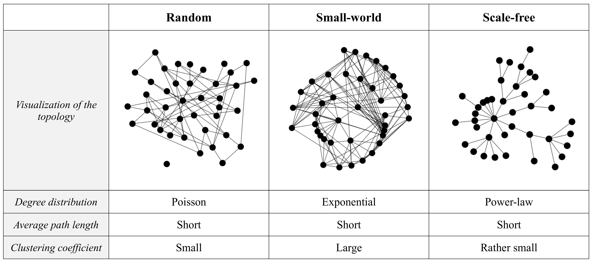
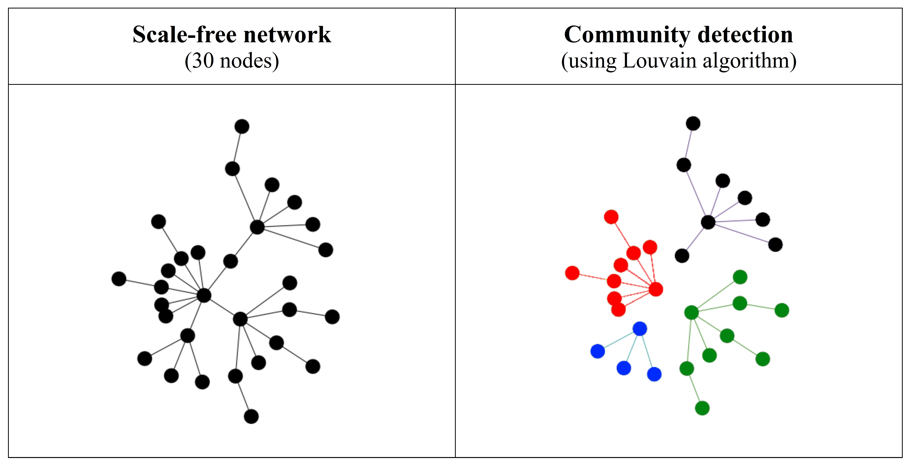
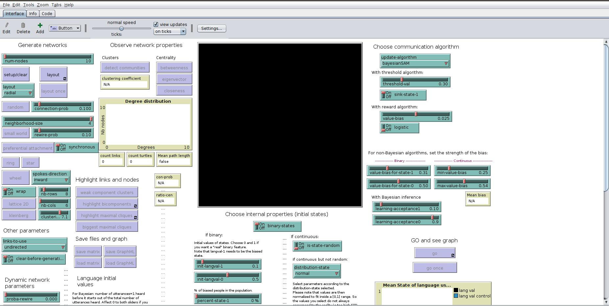
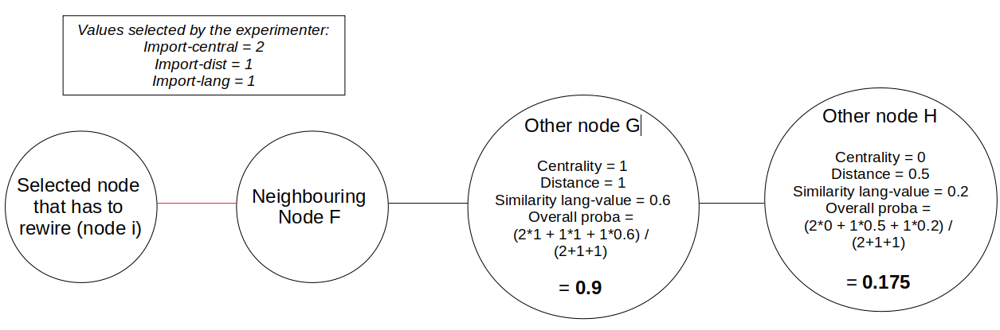

```{r setup, echo=FALSE, message=FALSE, warning=FALSE}
#knitr::opts_chunk$set(echo = TRUE, fig.width=12, fig.height=8)

## Knitting options:
knitr::opts_chunk$set(echo=FALSE, warning=FALSE, message=FALSE,   
                      fig.pos = "!H", # default code chunk options
                      fig.width=12, fig.height=8, fig.align="center", comment=NA, # default figure dimensions
                      fig.path="./figures/",                                      # save images to ./figures/
                      dpi=300, dev="jpeg",                                         # please set dpi=300 and comment out dev="jpeg" for high resolution but very big images
                      cache=FALSE, autodep=TRUE);                                  # cache chunks


## Various folders:
#setwd("F:/DDL_computer/Documents/ABM/")
if( !dir.exists("./figures") ) dir.create("./figures", showWarnings=FALSE); # figures are saved here


# librarys
library(knitr);
library(data.table)
options(stringsAsFactors = FALSE)
library(ggpubr)
library(ggplot2)
library(gridExtra)
library(scales)
library(tidyr)
library(pracma) # used for function linspace
library(pander)
library(multcomp)


# Figure and Table caption adapted from https://stackoverflow.com/questions/37116632/rmarkdown-html-number-figures: 
outputFormat = opts_knit$get("rmarkdown.pandoc.to"); # determine the output format of the document
if( is.null(outputFormat) ) outputFormat = ""; # probably not run within knittr
capTabNo = 1; capFigNo = 1; # figure and table caption numbering, for HTML do it manually

#Function to add the Figure Number
capFig = function(x){
  if(outputFormat == 'html'){
    x = paste0("**Figure ",capFigNo,".** ",x,"")
    capFigNo <<- capFigNo + 1
  }; x
}


# plot info for plots

info_plots = function(x, y){
  
   # check some element in order to put the stars in the right position
  if (element == "size_net"){
    if (situation=="all_hetero"){
      my_comparisons = list(c("  50", "  500") , c("  50", "  150"), c("  150", "  500"))
    } else {
      my_comparisons = list(c("  10", "  50"), c("  50", "  500"), c("  50", "  1000"), c("  10", "  150"), c("  10", "  500"), c("  10", "  1000"), c("  150", "  1000"))
    }
    position_stars_langval <- c(1, 1.1, 1.2, 1.3, 1.4, 1.5, 1.6)
    position_stars_diffgroup <- c(0.85, 0.95, 1.05, 1.15, 1.25, 1.35)
    position_stars_stab <- c(900, 910, 920, 930, 940, 950, 960)
    position_stars_hetero <-  c(0.33, 0.36, 0.39, 0.42, 0.45, 0.48, 0.51, 0.54, 0.57, 0.61, 0.64)

    title <- "Size"
    yname_langval <- "Language value after 1000 iterations"
    yname_diffgroup <- "Difference between unbiased and biased agents"
    yname_stab <- "Stabilization time"
    yname_inter <- "Heterogeneity between communities"
    yname_intra <- "Heterogeneity within communities"
    yname_diss <- "Dissemination (sd of replications)"
    }
  if (element == "network"){
    my_comparisons = list( c("    s-f", "    s-w"), c("    s-w", "    ran"), c("    s-f", "    ran"))
    position_stars_langval <- c(1.15, 1.3, 1.45)
    position_stars_diffgroup <- c(0.85, 0.95, 1.05)
    position_stars_stab <- c(900, 930, 960)
    title <- "Network"
    yname_langval <- "" ; yname_diffgroup <- "" ; yname_stab <- "" ; yname_inter <- "" ; yname_intra <- "" ; yname_diss <- ""
 ;   }
  if (element == "learners"){
    my_comparisons = list(c("  SAM", "  MAP"))
    position_stars_langval <-  c(1.2)
    position_stars_diffgroup <-  c(0.85)
    position_stars_stab <-  c(900)
    title <- "Learners"
    yname_langval <- "" ; yname_diffgroup <- "" ; yname_stab <- "" ; yname_inter <- "" ; yname_intra <- "" ; yname_diss <- ""
  }
  if (element == "prop_biased"){
    if (situation=="all" | situation=="all_hetero"){
       my_comparisons = list(c("    0", "    10"), c("    10", "    30"), c("    30", "    50"), c("    50", "    100"), c("    0", "    30"), c("    10", "    50"), c("    0", "    50"), c("    0", "    100"), c("    10", "    100"), c("    30", "    100"))
    }
    if (situation=="biased"){
      my_comparisons = list(c("    100", "    10"), c("    10", "    30"), c("    30", "    50"), c("    100", "    30"), c("    10", "    50"), c("    100", "    50"))
    }
    if (situation=="unbiased"){
      my_comparisons = list(c("    0", "    10"), c("    10", "    30"), c("    30", "    50"), c("    0", "    30"), c("    10", "    50"), c("    0", "    50"))
    }
    if (situation=="nobiased_nounbiased"){
      my_comparisons = list( c("    10", "    30"), c("    30", "    50"),  c("    10", "    50"))
    }
    position_stars_langval <-  c(1.10, 1.2, 1.3, 1.4, 1.5, 1.6, 1.7, 1.8, 1.9, 2)
    position_stars_diffgroup <- c(0.85, 0.95, 1.05)
    position_stars_stab <- c(840, 870, 900, 930, 960, 990, 1020, 1050, 1080, 1110, 1140, 1170, 1200, 1230, 1260)
    position_stars_hetero <-  c(0.33, 0.36, 0.39, 0.42, 0.45, 0.48, 0.51, 0.54, 0.57, 0.61, 0.64)
    title <- "% Biased"
    yname_langval <- "" ; yname_diffgroup <- "" ; yname_stab <- "" ; yname_inter <- "" ; yname_intra <- "" ; yname_diss <- ""
  }
  if (element == "bias_strength"){
    my_comparisons = list(c("strong","weak"))
    position_stars_langval <-  c(1.2)
    position_stars_diffgroup <-  c(0.85)
    position_stars_stab <-  c(900)
    title <- "Strength bias"
    yname_langval <- "" ; yname_diffgroup <- "" ; yname_stab <- "" ; yname_inter <- "" ; yname_intra <- "" ; yname_diss <- ""
  }
  if (element == "influencers_biased"){
    my_comparisons = list(c("      0", "      10"))
    position_stars_langval <-  c(1.2)
    position_stars_diffgroup <-  c(0.85)
    position_stars_stab <-  c(900)
    title <- "% Influencers"
    yname_langval <- "" ; yname_diffgroup <- "" ; yname_stab <- "" ; yname_inter <- "" ; yname_intra <- "" ; yname_diss <- ""

  }
  if (element == "init_lang"){
    my_comparisons = list(c("    no", "    yes"))
    position_stars_langval <-  c(1.2)
    position_stars_diffgroup <-  c(0.85)
    position_stars_stab <-  c(900)
    title <- "Initial lang."
    yname_langval <- "" ; yname_diffgroup <- "" ; yname_stab <- "" ; yname_inter <- "" ; yname_intra <- "" ; yname_spacorr1 <- "" ; yname_spacorr2 <- "" ; yname_diss <- ""
  }
  
  my_list <- list("my_comparisons" = my_comparisons, 
                  "position_stars_langval" = position_stars_langval, 
                  "position_stars_diffgroup" = position_stars_diffgroup,
                  "title" = title,
                  "yname_langval" = yname_langval,
                  "yname_diffgroup" = yname_diffgroup,
                  "yname_stab" = yname_stab,
                  "yname_inter" = yname_inter,
                  "yname_intra" = yname_intra,
                  "yname_diss" = yname_diss)
  return(my_list) 
}

# ---------- FUNCTION ------------ #

# this function find the alpha and beta parameters with the following inputs:

# *best*: mode of the beta distribution
# *lower*: The parameter value is with 100*p% certainty greater than lower
# *upper*: The parameter value is with 100*p% certainty smaller than upper
# *p*: The parameter value lies with 100*p% in between lower and upper

# found from prevalence package (problem to install it, only the function was imported)
# https://www.rdocumentation.org/packages/prevalence/versions/0.4.0/topics/betaExpert


betaExpert <-
  function(best, lower, upper, p = 0.95, method = "mode"){

    ## functions to optimize ~ mode
    f_mode <-
      function(x, mode, p, target){
        return(
          sum(
            (qbeta(p = p,
                   shape1 = x,
                   shape2 = (x * (1 - mode) + 2 * mode - 1) / mode) -
               target) ^ 2
          ))
      }
    
    f_mode_zero <-
      function(x, p, target){
        return((qbeta(p = p, shape1 = 1, shape2 = x) - target) ^ 2)
      }
    
    f_mode_one <-
      function(x, p, target){
        return((qbeta(p = p, shape1 = x, shape2 = 1) - target) ^ 2)
      }
    
    ## functions to optimize ~ mean
    f_mean <-
      function(x, mean, p, target){
        return(
          sum(
            (qbeta(p = p,
                   shape1 = x,
                   shape2 = (x * (1 - mean)) / mean) -
               target) ^ 2
          ))
      }
    
    ## define 'target' and 'p'
    if (!missing(lower) & missing(upper)){
      target <- lower
      p <- 1 - p
    } else if (!missing(upper) & missing(lower)){
      target <- upper
    } else if (!missing(upper) & !missing(lower)){
      target <- c(lower, upper)
      p <- c(0, p) + (1 - p) / 2
    }
    
    ## derive a and b (=shape1 and shape2)
    if (method == "mode"){
      if (best == 0){
        a <- 1
        b <- optimize(f_mode_zero, c(0, 1000), p = p, target = target)$minimum
      } else if (best == 1) {
        a <- optimize(f_mode_one, c(0, 1000), p = p, target = target)$minimum
        b <- 1
      } else {
        a <- optimize(f_mode, c(0, 1000),
                      mode = best, p = p, target = target)$minimum
        b <- (a * (1 - best) + 2 * best - 1) / best
      }
    } else if (method == "mean"){
      a <- optimize(f_mean, c(0, 1000),
                    mean = best, p = p, target = target)$minimum
      b <- (a * (1 - best)) / best
    }
    
    ## create 'out' dataframe
    out <- list(alpha = a, beta = b)
    class(out) <- "betaExpert"
    
    ## return 'out'
    return(out)
  }


```


# Introduction

## Dataset

```{r read file, echo=FALSE, message=FALSE, warning=FALSE}

setwd("/media/mathilde/Elements/DDL_computer/Documents/ABM/ABM_folder/ABM/Inputfiles")

# -----  READ TABLE "example"  ----- #

# read table
data_ex <- read.table("example_time.csv", header=T, sep=",", quote='"', fill=TRUE)

# aggregated language value by replication
data_ex_aggr <- aggregate(
  list(langval_all = data_ex$langval_all, 
       langval_biased = data_ex$langval_biased, 
       langval_control = data_ex$langval_control), 
  by=list(prop_biased = data_ex$prop_biased, 
          bias_strength = data_ex$bias_strength, 
          influencers_biased = data_ex$influencers_biased, 
          ticks = data_ex$ticks, network=data_ex$network), 
  FUN=mean)


# -----  READ TABLE "analysis.csv"  ----- #

# # read all files separately and merge them
# data1 <- read.table("analysis_part1.csv", header=T,  sep=",", quote='"', fill=TRUE)
# data2 <- read.table("analysis_part2.csv", header=T,  sep=",", quote='"', fill=TRUE)
# data3 <- read.table("analysis_part3.csv", header=T,  sep=",", quote='"', fill=TRUE)
# data <- rbind(data1, data2, data3)
# write.table(data, "analysis.csv", sep=",", col.names=TRUE, row.names=FALSE, quote=FALSE)

# read table
data <- read.table("analysis.csv", header=T,  sep=",", quote='"', fill=TRUE) 

# create a new column with the difference, at tick = 1000, between control nodes and biased nodes
# note : these numbers are extremely similar with the parwaise comparison between all nodes
data$diff_group <- data$langval_control_1000 - data$langval_biased_1000

# -----  READ TABLE "extra_analysis.csv"  ----- #

# read table
data_extra <- read.table("extra_analysis.csv", header=T,  sep=",", quote='"', fill=TRUE) 

# aggregated language value by replication
data_aggr_extra <- aggregate(data_extra$langval_all, by=list(prop_biased = data_extra$prop_biased, bias_strength = data_extra$bias_strength, influencers_biased = data_extra$influencers_biased, ticks = data_extra$ticks, network=data_extra$network), FUN=mean)

```


```{r, include=FALSE}

### Other information useful for beautiful plots...

# create a new table with one single column for all language values (langval all, langval biased, langval unbiased)
data_long_langval <- gather(data, condition, measurement, langval_all_1000:langval_biased_1000)

# Create sub dataframe with new names, so that all graphs are all aligned in the same x axis.
# probably a better/easier way to do it... but I could not find it
data_factors <- data
data_factors$learners[data_factors$learners == "SAM"] <- "  SAM"
data_factors$learners[data_factors$learners == "MAP"] <- "  MAP"
data_factors$network[data_factors$network == "Scale-free"] <- "    s-f"
data_factors$network[data_factors$network == "Small-world"] <- "    s-w"
data_factors$network[data_factors$network == "Random"] <- "    ran"

data_factors$init_lang[data_factors$init_lang == "0"] <- "    no"
data_factors$init_lang[data_factors$init_lang == "4"] <- "    yes"

data_factors$bias_strength[data_factors$bias_strength == "0.1"] <- "strong"
data_factors$bias_strength[data_factors$bias_strength == "0.6"] <- "weak"

#data_factors$prop_biased <- as.factor(data_factors$prop_biased)
data_factors$prop_biased[data_factors$prop_biased == "0"] <- "    0"
data_factors$prop_biased[data_factors$prop_biased == "10"] <- "    10"
data_factors$prop_biased[data_factors$prop_biased == "30"] <- "    30"
data_factors$prop_biased[data_factors$prop_biased == "50"] <- "    50"
data_factors$prop_biased[data_factors$prop_biased == "100"] <- "    100"
data_factors$prop_biased <- factor(data_factors$prop_biased, levels=c("    0", "    10", "    30", "    50", "    100"))

data_factors$influencers_biased[data_factors$influencers_biased == "0"] <- "      0"
data_factors$influencers_biased[data_factors$influencers_biased == "10"] <- "      10"

data_factors$size_net[data_factors$size_net == "10"] <- "  10"
data_factors$size_net[data_factors$size_net == "50"] <- "  50"
data_factors$size_net[data_factors$size_net == "150"] <- "  150"
data_factors$size_net[data_factors$size_net == "500"] <- "  500"
data_factors$size_net[data_factors$size_net == "1000"] <- "  1000"
data_factors$size_net <- factor(data_factors$size_net, levels=c("  10", "  50", "  150", "  500", "  1000"))

# Find starting value of the language for unbiased and biased agents, for each bias strengh (0.1, 0.6) and init_lang (0, 4)
vec <- unique(data$langval_biased_0[data$init_lang==4 & (data$bias_strength==0.1)])
biased_4_0.1 <- vec[!is.na(vec)][1]

vec <- unique(data$langval_biased_0[data$init_lang==4 & (data$bias_strength==0.6)])
biased_4_0.6 <- vec[!is.na(vec)][1]

vec <- unique(data$langval_control_0[data$init_lang==4] )
unbiased_4 <- vec[!is.na(vec)][1]

vec <- unique(data$langval_biased_0[data$init_lang==0 ])
biased_0 <- vec[!is.na(vec)][1]

vec <- unique(data$langval_control_0[data$init_lang==0 ])
unbiased_0 <- vec[!is.na(vec)][1]
```

We ran simulations with Netlogo model (see Github [mathjoss/bayes-in-network](https://github.com/mathjoss/bayes-in-network)), using different combination of parameters (structure of the network, percentage of biased people, shape of the bias...) and measuring multiple variables related to the language value of the population.

The results are stored in 3 different files :

| Input file | Format      | DV | IV | Number of replications | Maximum number of ticks |
|------------|-------------|-------------|-------------| -------------| -------------|
| `example_time.csv` | CSV file | language value (all agents, biased agents, unbiased agents) | Scale-free, 500 agents, SAM, 10% biased agents, initial language | 100 | 1000 |
| `analysis.csv` | CSV file | - language value (all agents, biased agents, unbiased agents)  <br> - stabilisation time (all agents, biased agents, unbiased agents) <br> - communities (mean and std of the language value + number of agents in each community) |  set of combination **1** (see [Set of combination 1 - analysis.csv]) | 100 | 1000 |
| `extra_analysis.csv` | CSV file | language value (all agents) | set of combination **2** (see [Set of combination 2 - extra_analysis.csv]) | 50 | 500 |


## Framework - methods 

Our framework is implemented in NetLogo 6.1.1 (https://ccl.northwestern.edu/netlogo/), the experiments were run on an Intel Core i7-8700, 32Gb RAM system under Ubuntu 18.04, and the results analysed using R 3.6.3/Rstudio 1.4 on machines running Ubuntu 18.04 and macOS 10.15 (Catalina); the full source code and results are available at Github ([mathjoss/bayes-in-network](https://github.com/mathjoss/bayes-in-network)).

Our simulation framework is based on previously published models [@dediu_genetic_2009], [@dediu_role_2008] and has three main components: the language, the agents, and the communicative network. The language is modelled here as being composed of one (or more) binary features, that are obligatorily expressed in each individual utterance produced or perceived by the agents. We may think of these abstract features as representing, for instance, the use of the alveolar trill /r/ (value 1) or of a different r-like sound (value 0), the use of pitch to make a linguistic distinction (1) or not (0), having a subject-verb word order (1) or a verb-subject order (0), making a gender distinction (1) or not (0), using center embedding (1) or not (0), or any other number of such alternatives. Thus, if we take the /r/ interpretation, a set of utterances {1,1,1} might be produced by an agent that can trill without issues, a {0,0,0} by one that cannot, and {1,0,1} by an agent that either does not make the distinction or whose ability to trill is affected by other factors (e.g., socio-linguistic or co-articulatory). Each agent embodies three components: language acquisition, the internal representation of language, and the production of utterances. The first concerns the way observed data (in the form of “heard” utterances) affect (or not) the internal representation of language that the agent has. The second is the manner in which the agent maintains the information about language. And the third, the way the agent uses its internal representation of the language to produce actual utterances.

We opted here for a Bayesian model of language evolution as introduced by [@griffiths_language_2007], and widely used in recent studies of language evolution and change (e.g. [@dediu_genetic_2009], [@dediu_role_2008], [@kirby_innateness_2007], among others). To do so, we used agent-based modeling in Netlogo, where we created societies of agents sharing connections with each other. Netlogo programs is available on Github [mathjoss/bayes-in-network](https://github.com/mathjoss/bayes-in-network) and contains a lot of functionalities not used in this analysis. To understand how to use our Netlogo code and parameters, please refer to [Appendix: Netlogo guide].

As a general approach, it proposes that there is a universe of possible languages (discrete or continuous), $h \in U,$ and that an agent maintains at all times a probability distribution over all these possible languages. Initially, before seeing any linguistic data, the agent has a prior distribution over these possible languages, $p(h)$, and, as new data (in the form of observed utterances), $d = \{u_{1}, u_{2}, … u_{n}\}$, come in, this probability is updated following Bayes’ rule, resulting in the posterior distribution: $$p(h|d) = \frac{p(d|h).p(h)}{p(d)}$$ that reflects the new representation that the agent has of the probability of each possible language $h \in U$ after having heard the utterances composing the data $d$. In this, $p(d|h)$ is the likelihood that the observed data $d$ was generated by language $h$, and $p(d)$ is a normalisation factor ensuring that $p(h|d)$ is a probability bounded by 0.0 and 1.0. 


In this paper, we model a single binary feature and consequently the utterances, $u$, collapse to a single bit of information, “0” or “1”. The observed data, $d$, become binary strings, and one of the simplest models of language is that of throwing a (potentially unfair) coin that returns, with probability $h \in [0,1]$, a “1” (otherwise, with probability $1-h$, a “0”). Thus, the universe of our languages, $h$, is the real number interval $U = [0,1] \subset {\rm I\!R}$, and the likelihood of observing an utterance $u \in \{ 0, 1 \}$ is given by the Bernoulli distribution with parameter $h$; for a set of utterances $d = \{u_{1}, u_{2}, … u_{n}\}$, the likelihood is given by the *binomial distribution* with parameters $k = |\{u_{i}=1\}_{i=1..n}|$ (the number of utterances “1”), $n$ (the total number of utterances), and $h: p(d|h) = Binomial(k,n,h) = \frac{n!}{k!(n-k)!}h^{k}(1-h)^{n-k}$, where $x! = 1 \cdot  2 \cdot  ... \cdot  (x-1) \cdot  x$; thus, we can reduce the set of utterances forming the data $d$, without any loss of information, to the number of “1” utterances ($k$) and the total number of utterances ($n$). In Bayesian inference we sometimes use the conjugate prior of a given likelihood, in this case, the Beta distribution defined by two shape parameters, $\alpha$ and $\beta$, with probability density $f(x,\alpha,\beta) = \frac{1}{B(\alpha,\beta)}x^{\alpha-1}(1-x)^{\beta-1}$, where $B(\alpha,\beta)$ normalizes the density between 0.0 and 1.0. With these, the prior distribution of language $h$ is $f(h,\alpha_{0},\beta_{0})$, with parameters $\alpha_{0}$ and $\beta_{0}$ defining the shape of this distribution (see below), and the posterior distribution, updated after seeing the data $d=(k,n)$, is $p(h|d) = f(h,\alpha_{1},\beta_{1})$, where $\alpha_{1} = \alpha_{0} + k$ and $\beta_{1} = \beta_{0} + (n-k)$; thus, the posterior distribution is also distributed Beta, with the shape parameter $\alpha$ “keeping track” of the “1” utterances, and $\beta$ of the “0” utterances, and the Bayesian updating is reduced to simple (and very fast) arithmetic operations. When it comes to utterance production, a SAM agent chooses a value  $h \in [0,1]$ from the $B(\alpha_{1},\beta_{1})$ distribution (i.e., proportional to $f(h,\alpha_{1},\beta_{1})$)), while a MAP picks the mode of the distribution, $h_{M} = \frac{\alpha_{1}-1}{\alpha_{1}+\beta_{1}-2}$; afterward, the agent uses this number between 0.0 and 1.0 as the parameter of a Bernoulli distribution (a coin throw) to extract a single “0” or “1” value with this probability -- this value then is the utterance that the agent produces.

This choice (Bernoulli/Beta) not necessarily reflects how data is used by real humans in learning a language, but it has several major advantages, most notably its simplicity, transparency, and computational efficiency making it possible to run very large simulations on a consumer-grade computer in reasonable time [@dediu_genetic_2009]. Probably the most relevant here concerns the fact that the bias can be modeled only through the shape parameters of the prior Beta distribution, $\alpha_{0}$ and $\beta_{0}$, as the likelihood function is fixed to the Binomial, and the utterance produce offers only a limited choice between SAM and MAP. However, the Beta distribution is notoriously flexible, and can be used to represent from (almost) flat (or uninformative) distributions, to extremely peaked and to “U”-shaped ones. Moreover, for unimodal cases, we can model not only the *location* of the peak (i.e., the “preferred” value), but also the *spread* of this peak (i.e., how “strong” is this preference, operationally, how much data is needed to change the preferred value); we actually describe the Beta distribution using these alternative parameters, the mode $\mu$ (describing the “preferred location”) and the “spread” $\lambda$, which are linked to the shape parameters $\alpha$ and $\beta$ (see Box 1). Thus, arguably, the Beta distribution is flexible enough to model relatively well an intuitive view of how such a bias might look like -- not just a preferred value but also a strength of this preference. See Figure 1 for an example of how different prior distributions are updated upon seeing some data.

You can see more details about this process in [Strength and location of the bias].

## Independent variables

In our Netlogo model, we used the following variables:

Parameters | Variable name | Dependencies | Comments |
|------------|-------------|-------------|-------------|
| Network size | *size_net* | none |  The number of agents (i.e., agents); it is fixed for a given run |
| Frequency of biased agents | *prop_biased* | none |  The proportion of agents in the network that are biased; please note that here we consider networks containing a single type of biased agents |
| Bias location and strength | *bias_strength* | none |  Only the strength value of biased agents varies ; the value for unbiased agent is fixed and set to $\mu_{0} = 0.5$, $\lambda_{0} = 0.9$. See more information in [Strength and location of the bias] |
| Proportion of highest centrality agents that are biased | *influencers_biased* | depends on *prop_biased* |  More information in [Influencers biased] |
| Utterance production mechanism | *learners* | none | More information in [Learners] |
| Network type | *network* | none | More information in [Network type] |
| Initial language | *init_lang* | none |  The total number of utterances (n0) and the number of utterances “1” (k0) presented to all the agents in the network in the initial iteration i = 0. More information in [Initial language] |


#### Set of combination 1 - analysis.csv

The parameters we used in the set of combination **1** are the following:

Variable | Values      |
|------------|-------------|
| *size_net* | 10 (“tiny”) <br> 50 (“small”) <br> 150 (“medium”) <br> 500 (“large”) <br> 1000 (“very large”) |
| *prop_biased* | 0% (“fully unbiased”) <br> 10% <br> 30% <br> 50% <br> 100% (“fully biased”) | 
| *bias_strength* | $\mu_{0} = 0.1,$ $\lambda_{0} = 0.6$ (“biased flexible”) <br> $\mu_{0} = 0.1$, $\lambda_{0} = 0.1$ (“biased rigid”) | 
| *influencers_biased* | 0% (“Random”) <br> 10% (“biased influences”) | 
| *learners* | SAM (“sampler”) <br> MAP (“a posteriori maximizer”) | 
| *network* | Random <br> Scale-free <br> Small-world |
| *init_lang* | k0 = 0, n0 = 0 (“no initial language”) <br> k0 = 4, n0 = 4 (“initial language”) | 


#### Set of combination 2 - extra_analysis.csv

The parameters we used in the set of combination **2** are the following:

Variable | Values      |
|------------|-------------|
| *size_net* | 150 (“medium”)  |
| *prop_biased* | 0 to 100%, **in steps of 1%** | 
| *bias_strength* | $\mu_{0}$ = 0.1 (biased), $\lambda_{0}$ = 0.01 to 0.99, **in steps of 0.01** | 
| *influencers_biased* | 0% (“Random”) <br> 50% (“biased influences”) <br> 100% (“biased extremely influent”) |
| *learners* | SAM (“sampler”) | 
| *network* | Random <br> Scale-free <br> Small-world |
| *init_lang* | k0 = 4, n0 = 4 (“initial language”) | 

### Strength and location of the bias

The first *internal representation of the language* (at $t = 0$) is represented by a Beta distribution (*alpha*, *beta*). However, the Beta distribution is notoriously flexible, and can be used to represent from (almost) flat (or uninformative) distributions, to extremely peaked and to “U”-shaped ones. For unimodal cases, we can model:

 -  $\mu_{0}$: location of the bias (or mode), i.e., the “preferred” value. The higher, the more likely the individual will produce utterances = 1
 -  $\lambda_{0}$: the spread of the peak (or strength of the bias), i.e., how “strong” is this preference, operationally, how much data is needed to change the preferred value. The higher, the less strongly biased.

We actually describe the Beta distribution using these alternative parameters, the mode $\mu_{0}$ and the “spread” $\lambda_{0}$, which are linked to the shape parameters (*alpha*, *beta*) using a small algorithm: 

 -  the user can select the mode of the Beta distribution (= the location of the bias), and the learning acceptance (= how strong the bias is);
 -  the program computes the lower and upper uncertainty limits from the given mode and learning acceptance, such that these limits are within the interval [0, 1];
 -  the values for the mode and the upper and lower limits are passed to the `betaExpert` from from the `prevalence` package, which computes the unique values of *alpha* and *beta*;
for optimization and future-proofing reasons, we precomputed and hard-coded the *alpha* and *beta* values used in this paper within our NetLogo script (available in the GitHub repository [mathjoss/bayes-in-network](https://github.com/mathjoss/bayes-in-network)).

(see hidden code below for more information)


```{r, strength location, echo=FALSE, message=FALSE, warning=FALSE}
# ---------- SELECT PRIORS ------------ #

# choose the mode
mu = 0.5 
# do NOT select mu = 0 and 1 (but 0.001 and 0.999 are fine...)

# choose the learning acceptance: this value goes:
##### from 0.00001  (do NOT select learning_acceptance = 0)
# --> it shows that the person is very very very reluctant to change its feature 
##### to 1 
# above 0.99, the algorithm consider that the person do not have any biased prior, whatever the mu 
# consequently, for learning acceptance > 0.99, the prior distribution will be flat
# it indicates that the bias value (mu) is very very small, and the person is ready to change its language value according to other people utterances

#for (el in seq(0.01, 0.99, by=0.01)){ # used to print all values for netlogo import

learning_acceptance = 0.9 # this λ0, and goes from 0 to 1

# compute the upper and lower value if there is a bias
if (learning_acceptance <= 0.99){
  if (mu<0.50){
    range <- (1-mu)*learning_acceptance # learning bias is from 0 to 100, but the range is computed according to the value of mu (so it won't go above or below 0)
    upperuncert <- mu + range
    if (range>mu){
      loweruncert <- 0.01
    } else { loweruncert <- mu - range }
  }
  
  if (mu>0.50){
    range <- (mu)*learning_acceptance
    loweruncert <- mu - range
    if (range>(1-mu)){
      upperuncert <- 0.99
    } else { upperuncert <- mu + range }
  }
  
  if (mu==0.50){
    range <- (mu)*learning_acceptance
    loweruncert <- mu - range
    upperuncert <- mu + range
  }
  
  params <- betaExpert(best = mu, lower = loweruncert, upper = upperuncert, p = 0.99)
  a = params$alpha
  b = params$beta
} else {a=1; b=1} # if there is no bias, immediately affect 1 to alpha and beta


```

In order to run faster simulation, and to prevent compatibility problems in Netlogo, we saved these alpha and beta values directly inside the Netlogo code. For example, this algorithm creates the following *alpha* and *beta* values according to $\mu_{0}$ and $\lambda_{0}$: 

| ($\mu_{0}$, $\lambda_{0}$) | (alpha, beta) | Parameter |
|------------|-------------|-------------|
| (0.1, 0.1) | (10.96, 90.62)  | (“biased rigid”) |
| (0.1, 0.6) | (1.58, 6.19)  | (“biased flexible”) |
| (0.5, 0.9) | (2.2, 2.2)  | (“unbiased”) |

They can be visually represented like this:
```{r, strength location 2, echo=FALSE, message=FALSE, warning=FALSE, fig.cap=capFig('Visualization of Beta distributions.'),  fig.width=10, fig.height=6}

theta = linspace(0,1,100)

# initial prior of the agents
initial_prior <- data.frame(Theta=theta,
                            Prior1 = dbeta(theta, 10.96, 90.62), # Biased rigid
                            Prior2 = dbeta(theta, 1.58, 6.19), # Biased flexible
                            Prior3 = dbeta(theta, 2.1997, 2.1997)) # Unbiased

# change table format and name
initial_prior_long <- gather(initial_prior, condition, measurement, Prior1:Prior3)
initial_prior_long$type_agent <- "Biased agents"
initial_prior_long$type_agent[initial_prior_long$condition=="Prior3"] <- "Unbiased agents"

# plot
ggplot(initial_prior_long, aes(x=Theta, y=measurement)) + 
  xlim(0,1) +
  labs(y="Probability Density", x="") +
  facet_grid( ~ type_agent) +
  theme_bw(base_size=18) +
  geom_line(aes(colour=condition))+
  theme(legend.title=element_blank()) +
  scale_colour_manual(values = c("blue3", "brown3", "black"), name = "condition",  labels = c("Biased rigid", 
                                                       "Biased flexible", 
                                                       "Unbiased")) 

```

Hearing utterances will gradually change the internal representation of the language for each agent, whatever their starting distribution. 

For example, after hearing 10 and 20 utterances = 1, the internal representation of the language will be like:

```{r, strength location 3, echo=FALSE, message=FALSE, warning=FALSE, fig.cap=capFig('The evolution of some examples of Beta priors (thick solid curves) after seeing some data (utterances), to become successive Beta posterior distributions (thin curves). Blue: an individual strongly biased against the feature; red: an individual weakly biased against the feature; and black: an unbiased individual. Top row: the prior distributions before seeing any data (“at birth”)’ middle row: the Beta distributions updated after seeing n=10 utterances all containing the value “1”; bottom row: after seeing n=20 such utterances. '),  fig.width=10, fig.height=8}

# probably an easier way to do it: but could not find it..

# initial prior of the agents
initial_prior <- data.frame(Theta=theta,
                            Prior1 = dbeta(theta, 10.96, 90.62),
                            Prior2 = dbeta(theta, 1.58, 6.19),
                            Prior3 = dbeta(theta, 2.1997, 2.1997),
                            number = c(1:100))
initial_prior$time <- 0

# add to the initial table the new prior of individuals after they hear utterance (from 2 to 50 in steps of 2)
for (step in seq(2, 50, by=2)) {
  N1 = step # total of utterances
  X = step # number of utterances with the feature
  prior_step <- data.frame(Theta=theta,
                            Prior1 = dbeta(theta, 10.96+X, 90.62+N1-X),
                            Prior2 = dbeta(theta, 1.58+X, 6.19+N1-X),
                            Prior3 = dbeta(theta, 2.1997+X, 2.1997+N1-X),
                            number = c(1:100))
  prior_step$time <- step
  initial_prior <- rbind(initial_prior, prior_step)
}

# change table format and name for plotting
priors_long <- gather(initial_prior, condition, measurement, Prior1:Prior3)
priors_long$type_agent <- "Biased agents"
priors_long$type_agent[priors_long$condition=="Prior3"] <- "Unbiased agents"

# create a new variable 'condition_time' containing the info to know if the prior is at birth, after 10 utterances, or after 20 utterances
priors_long$`at birth` <- 0 ; priors_long$`after 10 utterances = 1` <- 0 ; priors_long$`after 20 utterances = 1` <- 0
priors_long$`at birth`[priors_long$time<1] <- 1
priors_long$`after 10 utterances = 1`[priors_long$time<11] <- 1
priors_long$`after 20 utterances = 1`[priors_long$time<21] <- 1
priors_long_long <- gather(priors_long, condition_time, measurement_time, `at birth`:`after 20 utterances = 1`)
priors_long_long$condition_time <- factor(priors_long_long$condition_time, levels=c("at birth", "after 10 utterances = 1", "after 20 utterances = 1"))

# create a new variables 'time2' that will tell if the curve are opaque or not... 
priors_long_long$time2 <- 0
priors_long_long$time2[priors_long_long$measurement_time==1 & priors_long_long$time==0 & priors_long_long$condition_time=="at birth"] <- 20
priors_long_long$time2[priors_long_long$measurement_time==1 & priors_long_long$time==10 & priors_long_long$condition_time=="after 10 utterances = 1"] <- 20
priors_long_long$time2[priors_long_long$measurement_time==1 & priors_long_long$time==8 & priors_long_long$condition_time=="after 10 utterances = 1"] <- 16
priors_long_long$time2[priors_long_long$measurement_time==1 & priors_long_long$time==6 & priors_long_long$condition_time=="after 10 utterances = 1"] <- 12
priors_long_long$time2[priors_long_long$measurement_time==1 & priors_long_long$time==4 & priors_long_long$condition_time=="after 10 utterances = 1"] <- 8
priors_long_long$time2[priors_long_long$measurement_time==1 & priors_long_long$time==2 & priors_long_long$condition_time=="after 10 utterances = 1"] <- 4
priors_long_long$time2[priors_long_long$measurement_time==1 & priors_long_long$time==0 & priors_long_long$condition_time=="after 10 utterances = 1"] <- 0
priors_long_long$time2[priors_long_long$measurement_time==1 & priors_long_long$time &priors_long_long$condition_time=="after 20 utterances = 1"] <- priors_long_long$time[priors_long_long$measurement_time==1 & priors_long_long$time &priors_long_long$condition_time=="after 20 utterances = 1"]
priors_long_long$time2 <- as.factor(priors_long_long$time2)

# plot
ggplot(priors_long_long[priors_long_long$measurement_time==1,], aes(x=Theta, y=measurement)) + 
  xlim(0,1) +
  facet_grid(condition_time ~ type_agent) +
  labs(y="Probability Density", x="") +
  theme_bw(base_size=18) +
  geom_line(aes(colour=condition, alpha=time2))+
  theme(legend.title=element_blank()) +
  scale_colour_manual(values = c("blue3", "brown3", "black"), name = "condition",  labels = c("Biased rigid", 
                                                       "Biased flexible", 
                                                       "Unbiased")) +
  scale_alpha_manual(values=c(rep(0.2, 10), 1))+
  guides(alpha=FALSE)

```


```{r, strength location 3 bis, echo=FALSE, message=FALSE, warning=FALSE, fig.cap=capFig('The evolution of some examples of Beta priors (thick solid curves) after seeing some data (utterances), to become successive Beta posterior distributions (thin curves). Blue: an individual strongly biased against the feature; red: an individual weakly biased against the feature; and black: an unbiased individual. Top row: the prior distributions before seeing any data (“at birth”)’ middle row: the Beta distributions updated after seeing n=10 utterances all containing the value “1”; bottom row: after seeing n=20 such utterances. '),  fig.width=10, fig.height=11}

# probably an easier way to do it: but could not find it..

# initial prior of the agents
initial_prior <- data.frame(Theta=theta,
                            Prior1 = dbeta(theta, 10.96, 90.62),
                            Prior2 = dbeta(theta, 1.58, 6.19),
                            Prior3 = dbeta(theta, 2.1997, 2.1997),
                            number = c(1:100))
initial_prior$time <- 0

# add to the initial table the new prior of individuals after they hear utterance (from 2 to 50 in steps of 2)
for (step in seq(2, 50, by=2)) {
  N1 = step # total of utterances
  X = step # number of utterances with the feature
  prior_step <- data.frame(Theta=theta,
                            Prior1 = dbeta(theta, 10.96+X, 90.62+N1-X),
                            Prior2 = dbeta(theta, 1.58+X, 6.19+N1-X),
                            Prior3 = dbeta(theta, 2.1997+X, 2.1997+N1-X),
                            number = c(1:100))
  prior_step$time <- step
  initial_prior <- rbind(initial_prior, prior_step)
}

# change table format and name for plotting
priors_long <- gather(initial_prior, condition, measurement, Prior1:Prior3)
priors_long$type_agent <- "Biased agents"
priors_long$type_agent[priors_long$condition=="Prior3"] <- "Unbiased agents"

# create a new variable 'condition_time' containing the info to know if the prior is at birth, after 10 utterances, or after 20 utterances
priors_long$`at birth \n (no initial language)` <- 0 ; priors_long$`after 10 utterances = 1` <- 0 ; priors_long$`after 20 utterances = 1` <- 0 ;  priors_long$`after 4 utterances = 1 \n (initial language)` <- 0
priors_long$`at birth \n (no initial language)`[priors_long$time<1] <- 1
priors_long$`after 4 utterances = 1 \n (initial language)`[priors_long$time<5] <- 1
priors_long$`after 10 utterances = 1`[priors_long$time<11] <- 1
priors_long$`after 20 utterances = 1`[priors_long$time<21] <- 1
priors_long_long <- gather(priors_long, condition_time, measurement_time, `at birth \n (no initial language)`:`after 4 utterances = 1 \n (initial language)`)
priors_long_long$condition_time <- factor(priors_long_long$condition_time, levels=c("at birth \n (no initial language)", "after 4 utterances = 1 \n (initial language)", "after 10 utterances = 1", "after 20 utterances = 1"))

# create a new variables 'time2' that will tell if the curve are opaque or not...
priors_long_long$time2 <- 0
priors_long_long$time2[priors_long_long$measurement_time==1 & priors_long_long$time==0 & priors_long_long$condition_time=="at birth \n (no initial language)"] <- 20
priors_long_long$time2[priors_long_long$measurement_time==1 & priors_long_long$time==4 & priors_long_long$condition_time=="after 4 utterances = 1 \n (initial language)"] <- 20
priors_long_long$time2[priors_long_long$measurement_time==1 & priors_long_long$time==2 & priors_long_long$condition_time=="after 4 utterances = 1 \n (initial language)"] <- 10
priors_long_long$time2[priors_long_long$measurement_time==1 & priors_long_long$time==0 & priors_long_long$condition_time=="after 4 utterances = 1 \n (initial language)"] <- 0
priors_long_long$time2[priors_long_long$measurement_time==1 & priors_long_long$time==10 & priors_long_long$condition_time=="after 10 utterances = 1"] <- 20
priors_long_long$time2[priors_long_long$measurement_time==1 & priors_long_long$time==8 & priors_long_long$condition_time=="after 10 utterances = 1"] <- 16
priors_long_long$time2[priors_long_long$measurement_time==1 & priors_long_long$time==6 & priors_long_long$condition_time=="after 10 utterances = 1"] <- 12
priors_long_long$time2[priors_long_long$measurement_time==1 & priors_long_long$time==4 & priors_long_long$condition_time=="after 10 utterances = 1"] <- 8
priors_long_long$time2[priors_long_long$measurement_time==1 & priors_long_long$time==2 & priors_long_long$condition_time=="after 10 utterances = 1"] <- 4
priors_long_long$time2[priors_long_long$measurement_time==1 & priors_long_long$time==0 & priors_long_long$condition_time=="after 10 utterances = 1"] <- 0
priors_long_long$time2[priors_long_long$measurement_time==1 & priors_long_long$time &priors_long_long$condition_time=="after 20 utterances = 1"] <- priors_long_long$time[priors_long_long$measurement_time==1 & priors_long_long$time &priors_long_long$condition_time=="after 20 utterances = 1"]
priors_long_long$time2 <- as.factor(priors_long_long$time2)

# plot
ggplot(priors_long_long[priors_long_long$measurement_time==1,], aes(x=Theta, y=measurement)) +
  xlim(0,1) +
  facet_grid(condition_time ~ type_agent) +
  labs(y="Probability Density", x="") +
  theme_bw(base_size=18) +
  geom_line(aes(colour=condition, alpha=time2))+
  theme(legend.title=element_blank()) +
  scale_colour_manual(values = c("blue3", "brown3", "black"), name = "condition",  labels = c("Biased rigid",
                                                       "Biased flexible",
                                                       "Unbiased")) +
  scale_alpha_manual(values=c(rep(0.2, 10), 1))+
  guides(alpha=FALSE)

```

Same plot but presented differently:

```{r, strength location 4, echo=FALSE, message=FALSE, warning=FALSE, fig.cap=capFig('Visualization of Beta distributions and their evolution with time.'),  fig.width=12, fig.height=5}
# probably an easier way to do it: but could not find it!

initial_prior <- data.frame(Theta=theta,
                            Prior1 = dbeta(theta, 10.96, 90.62),
                            Prior2 = dbeta(theta, 1.58, 6.19),
                            Prior3 = dbeta(theta, 2.1997, 2.1997),
                            number = c(1:100))
initial_prior$time <- 0

for (step in seq(2, 50, by=2)) {
  N1 = step # total of utterances
  X = step # number of utterances with the feature
  prior_step <- data.frame(Theta=theta,
                            Prior1 = dbeta(theta, 10.96+X, 90.62+N1-X),
                            Prior2 = dbeta(theta, 1.58+X, 6.19+N1-X),
                            Prior3 = dbeta(theta, 2.1997+X, 2.1997+N1-X),
                            number = c(1:100))
  prior_step$time <- step
  initial_prior <- rbind(initial_prior, prior_step)
}

<!-- priors_long <- gather(initial_prior, condition, measurement, Prior1:Prior3) -->
<!-- priors_long$`at birth` <- 0 ; priors_long$`after 10 utterances = 1` <- 0 ; priors_long$`after 20 utterances = 1` <- 0 -->
<!-- priors_long$`at birth`[priors_long$time<1] <- 1 -->
<!-- priors_long$`after 10 utterances = 1`[priors_long$time<11] <- 1 -->
<!-- priors_long$`after 20 utterances = 1`[priors_long$time<21] <- 1 -->
<!-- priors_long_long <- gather(priors_long, condition_time, measurement_time, `at birth`:`after 20 utterances = 1`) -->

<!-- priors_long_long$time2 <- 0 -->
<!-- priors_long_long$time2[priors_long_long$measurement_time==1 & priors_long_long$time==0 & priors_long_long$condition_time=="at birth"] <- 20 -->
<!-- priors_long_long$time2[priors_long_long$measurement_time==1 & priors_long_long$time==10 & priors_long_long$condition_time=="after 10 utterances = 1"] <- 20 -->
<!-- priors_long_long$time2[priors_long_long$measurement_time==1 & priors_long_long$time==8 & priors_long_long$condition_time=="after 10 utterances = 1"] <- 16 -->
<!-- priors_long_long$time2[priors_long_long$measurement_time==1 & priors_long_long$time==6 & priors_long_long$condition_time=="after 10 utterances = 1"] <- 12 -->
<!-- priors_long_long$time2[priors_long_long$measurement_time==1 & priors_long_long$time==4 & priors_long_long$condition_time=="after 10 utterances = 1"] <- 8 -->
<!-- priors_long_long$time2[priors_long_long$measurement_time==1 & priors_long_long$time==2 & priors_long_long$condition_time=="after 10 utterances = 1"] <- 4 -->
<!-- priors_long_long$time2[priors_long_long$measurement_time==1 & priors_long_long$time==0 & priors_long_long$condition_time=="after 10 utterances = 1"] <- 0 -->
<!-- priors_long_long$time2[priors_long_long$measurement_time==1 & priors_long_long$time &priors_long_long$condition_time=="after 20 utterances = 1"] <- priors_long_long$time[priors_long_long$measurement_time==1 & priors_long_long$time &priors_long_long$condition_time=="after 20 utterances = 1"] -->

<!-- priors_long_long$time2 <- as.factor(priors_long_long$time2) -->
<!-- priors_long_long$condition_time <- factor(priors_long_long$condition_time, levels=c("at birth", "after 10 utterances = 1", "after 20 utterances = 1")) -->

<!-- ggplot(priors_long_long[priors_long_long$measurement_time==1,], aes(x=Theta, y=measurement)) +  -->
<!--   xlim(0,1) + -->
<!--   facet_grid(. ~ condition_time) + -->
<!--   labs(y="Probability Density", x="") + -->
<!--   theme_bw(base_size=20) + -->
<!--   geom_line(aes(colour=condition, alpha=time2))+ -->
<!--   theme(legend.title=element_blank()) + -->
<!--   scale_colour_manual(values = c("blue3", "brown3", "black"), name = "condition",  labels = c("Biased rigid",  -->
<!--                                                        "Biased flexible",  -->
<!--                                                        "Unbiased")) + -->
<!--   #scale_color_viridis_d(name = "condition", end=0.8, labels = c("Biased rigid",  -->
<!--   #                                                     "Biased flexible",  -->
<!--   #                                                     "Unbiased"))+ -->
<!--   scale_alpha_manual(values=c(rep(0.2, 10), 1))+ -->
<!--   guides(alpha=FALSE)  -->

<!-- ``` -->


### Initial language

The initial language parameter corresponds to two situations: 

 -  on the one hand, it can model the (quite unrealistic) case where agents are born in a society without any pre-existing language or where they are not exposed to any linguistic input (k0 = 0, n0 = 0), so that the agents must create their first utterances based only on their prior bias (*init_lang = 0* or *init_lang = no* in some plots). 
 
 -  on the other hand, it can model the more common case where agents are born in a society with a pre-existing language already biased towards the use of the feature (k0 = 4, n0 = 4); this is modelled by presenting all the agents with the same 4 utterances “1” in the initial iteration, so that the first utterances generated by the agents are based both on on their prior bias and the linguistic input from the society. In this analysis, the variant supported by agents having a bias (both strong or weak) is always the utterance “0” (*init_lang = 4* or *init_lang = yes* in some plots).

Here is a visualization of the Beta distribution curve of biased and unbiased agents, for both conditions of the initial language of the society: 
 
```{r init langval explain, echo=FALSE, message=FALSE, warning=FALSE, fig.cap=capFig('With or without an initial language: these show the Beta distributions of the agents in the case where no initial language exists in the society (bottom row) and when such an initial language (mildly biased toward “1”) does exist (top row). The colors of the curves represent the three types of agents in our simulation (unbiased, and weakly and strongly biased; see also Figure 1).'),  fig.width=10, fig.height=7}

# initial prior of the agents
initial_prior <- data.frame(Theta=theta,
                            Prior1 = dbeta(theta, 10.96, 90.62),
                            Prior2 = dbeta(theta, 1.58, 6.19),
                            Prior3 = dbeta(theta, 2.1997, 2.1997))

initial_prior$time <- "No initial language"

# table with the new prior of agents after they have utterances
N1 = 4 # total of utterances
X = 4 # number of utterances with the feature
prior_step <- data.frame(Theta=theta,
                            Prior1 = dbeta(theta, 10.96+X, 90.62+N1-X),
                            Prior2 = dbeta(theta, 1.58+X, 6.19+N1-X),
                            Prior3 = dbeta(theta, 2.1997+X, 2.1997+N1-X))
prior_step$time <- "Initial language"

# merge the 2 tables and change format and name
prior <- rbind(initial_prior, prior_step)
prior_long <- gather(prior, condition, measurement, Prior1:Prior3)
prior_long$type_agent <- "Biased agents"
prior_long$type_agent[prior_long$condition=="Prior3"] <- "Unbiased agents"
prior_long$time <- as.factor(prior_long$time)

# plot
ggplot(prior_long, aes(x=Theta, y=measurement)) + 
  xlim(0,1) +
  labs(y="Probability Density", x="") +
  facet_grid(time ~ type_agent) +
  theme_bw(base_size=18) +
  geom_line(aes(colour=condition))+
  theme(legend.title=element_blank()) +
  ylim(0,15) +
  scale_colour_manual(values = c("blue3", "brown3", "black"), name = "condition",  labels = c("Biased rigid", 
                                                       "Biased flexible", 
                                                       "Unbiased")) 

```

As the condition with an initial language value of the society is more realistic, we will use this one preferentially in the computations.


### Learners

There are two widely-used strategies to produce utterances (among, the many possible ones; [@kirby_innateness_2007]): 

 -  **sampler strategy (SAM)**: a language h can be sampled at Random from the universe of possible languages proportional to its probability in the posterior distribution $p(h|d)$. 

 -  **maximum a posteriori strategy (MAP)**: we can pick the language $h_M$ that has the maximum posterior probability  $max_{h \epsilon U}(p(h|d))$


### Time

The network we used is **synchronous**: the language values of all agents are updated simultaneously at the end of each iteration, after all agents have talked once. More precisely, in a given iteration, each agent is selected in turn in a random order and is allowed to produce one utterance (“speak”), utterance which is “heard” by all its network neighbours. However, the agents do not update their internal representation of language until all have “spoken” (i.e., at the end of the iteration). In this way, each agent has the chance to “speak” and it does so using its representation of language from the previous iteration (if any), unaffected by any utterance they might have “heard” during the current iteration.

Each round, each individual says one utterance, and listen to the utterance(s) of his neighbor(s). The language value of all individuals are updated at the same time, when all individuals have talked once. 

In this analysis, we call each round a *tick*. 

We study the evolution of language on a period of time containing *1000* ticks for the main analysis, and *500* ticks for the systematic bias effect study.

### Network type

The network represents the socio-linguistic structure of a community, and constrains the linguistic interactions between agents. The agents are the network’s agents, and if there is an edge between two agents then those two agents will engage in linguistic interactions.
 
Please note that we consider here only static networks: there is no change, during a run, in the number of agents, the properties of the agents (bias and utterance production mechanism and in the topology of the network (i.e., the pattern of edges connecting the agents). 

Likewise, our model does not include directed nor weighted edges (i.e., the two connected agents can interact symmetrically, and there is no way to specify that two agents might interact “more” than others), but we do think that dynamic weighted directed networks are an important avenue to explore in the future. 

In this analysis, we use 3 different types of networks, always generated randomly in Netlogo: **Scale-free**, **Random**, and **Small-world** networks.

#### Scale-free networks

##### Algorithm

We use the preferential attachment algorithm [@barabasi_scale-free_2000]. It starts from a seed of agents and gradually adds new ones; new links are created between the newly-added agents and the pre-existing agents following the rule that the more a agent is connected, the greater its chance to receive new connections. Formally, the probability $p_i$ that a new agent is connected to agent $i$ is $p_i= \frac{k_i}{\sum_{j}k_j}$, where $k_i$ is the degree of agent $i$, and the sum is over all pre-existing agents $j$.
 
##### Characteristics

Scale-free networks exhibit a **power law degree distribution**: very few agents have a lot of connections, while a lot have a limited number of links. These type of networks are found, for example, on the Internet [@albert_diameter_1999] or in cell biology [@albert_scale-free_2005].

#### Small-world networks

##### Algorithm

We use a classic *beta model* of the Watts-Strogatz algorithm [@watts_collective_1998]. The algorithm first creates a ring of agents, where each agent is connected to a number $N$ of neighbours on either side, and then rewired with a chosen probability $p$. 

In this model, we always use the value $N = 4$ and $p=0.1$.

##### Characteristics

This process leads to the creation of hubs and the emergence of **short average path lengths**.
Small-world properties were popularized by [@milgram_small-world_1967]’s “Six degrees of separation” idea, and are found in many real-world phenomena, such as social influence networks [@kitsak_identification_2010] and semantic networks [@kenett_flexibility_2018].

#### Random networks

##### Algorithm

We use Erdos & Renyi popular algorithm [@erdos_random_1959]. We specify the number of agents and the overall connectivity of the graph giving the probability of adding an edge between any two agents ($p$); in this model, we always use $p=0.1$.

##### Characteristics

It is an unrealistic baseline model, which does not represent the structure of real-world networks.


#### Visualization



### Influencers biased

We are interested to know what happens if the most influential people in a network are biased. To investigate it, we created a variable *influencers_biased*: it corresponds to the percentage of highest centrality agents that are biased. 

As an example, if there are 20% of biased agents in the network, and 15% of influencers biased, it means that the 15% most influential agents will be biased, and 5% of the rest of the network will be randomly biased. Practically speaking:

 - if (*prop_biased*) $\geq$ (*influencers_biased*), the (*influencers_biased*) most popular agents are biased, the rest of biased agents being randomly chosen in the population
 - if (*prop_biased*) $<$ (*influencers_biased*), then (*prop_biased*) most popular agents are biased.
 
In the **main analysis**, we selected only 2 values for *influencers_biased* :

 -  **0%** of influencers biased, so the biased agents in the population are selected randomly;
 -  **10%** of influencers biased, so the 10% most influential agents are biased (if *prop_biased* >= 10, otherwise the *prop_biased* most influential agents are biased) 
 
 In the **systematic bias effect study**, we selected 3 values for *influencers_biased* :

 -  **0%** of influencers biased, so the biased agents in the population are selected randomly;
 -  **50%** of influencers biased, so the 50% most influential agents are biased (if *prop_biased* >= 50, otherwise the *prop_biased* most influential agents are biased) 
 -  **100%** of influencers biased, so the 100% most influential agents are biased (if *prop_biased* = 100, otherwise the *prop_biased* most influential agents are biased) 
 
Here, most influential agents are determined using measures for **eigenvector centrality** (see more [here](https://en.wikipedia.org/wiki/Eigenvector_centrality)).


## Dependent variables

We measured different variables using Netlogo BehaviorSpace tool.

Here is the exhaustive list of all variables that we used in this analysis:

### Language value

The language value of an agent at a given moment varies between 0 and 1, and is the mode of the Beta distribution representing the internal belief of the agent concerning the distribution of the probability of utterances “1” in the language. Biased agents typically start with a lower la than the unbiased agents, thus favoring the variant “0”. We also define the language value of a given group of agents (for example, a community or the whole network) as the mean of the language values of all the agents in the group. We decided to focus on the language value observed after 1,000 iterations, because the language value was always stabilized after this period. 

**Inter-individual variation** across the agents in a given network is an important outcome: we found that most biased and unbiased agents have very similar behaviors within their respective groups, justifying the use of the mean language values of the biased (*langval_biased*) and the unbiased agents (*langval_control*). We also computed the mean language value of the whole population (*langval_all*): even if there may be variation between groups (the biased vs the unbiased agents) and between agents, this value is a global indicator of the average language used in the population.

To summarize, we use the 3 following variables:

 - mean language value of **all** agents (*langval_all*) at final tick
 - mean language value of **biased** agents (*langval_biased*) at final tick
 - mean language value of **unbiased** agents (*langval_control*) at final tick
 
These variables were recorded directly inside BehaviorSpace, Netlogo.

### Difference between unbiased and biased agents

Here, we used the signed difference between the mean language values of the unbiased agents and the mean language values of biased agents, as this gives very similar results to the much more computationally expensive method of computing all pairwise differences between all unbiased and biased agents:

 - difference of mean language value of **unbiased** agents and mean language value of **biased** agents (*diff_group*)

We computed this variable from the previous language value means, in R. 

### Stabilization time

Intuitively, stabilisation time captures how long (in terms of interaction cycles) it takes for the language of a given network to reach a stable state. Given the inhomogeneous nature of the network, we consider two measures: the moment when the language value of the whole population stabilize (*stab_all*), the moment when the language value of the biased agents stabilizes (*stab_biased*) and the moment when the language value of the unbiased agents stabilizes (*stab_control*); these measures are estimated using the language values of their respective populations. To summarize, we use:

 - moment when the language value of the **society** stabilizes (*stab_all*)
 - moment when the language value of the **biased** agents stabilizes (*stab_biased*)
 - moment when the language value of the **unbiased** agents stabilizes (*stab_control*)
 
 Please note that the measure *stab_all* is the less accurate and representative of the actual behaviour of agents. Consequently, we decided to mainly study the results of *stab_biased* and *stab_control*.

These variables were computed using the mean language values above, on R. We used 2 different algorithms to compute the stabilization time (*method 1* and *method 2*). After checking the results, we found *method 2* to be more accurate, so this Rmarkdown only shows the results of the analysis using *method 2*.

#### Method 1

We used a discrete sliding window in which we estimate the derivative (i.e., change) and we recorded this change. After the window slided along the whole period of time, we selected the 15 values closest to 0. The value we chose as the stabilization time was the *earliest* value among these 15 values.

This method is based on the method used by [@jannsen_let_2018] (p. 79). Pratically speaking:

The maximum number of ticks of our model is $nIterations = 1000$, and the size of the sliding window is $w = nIterations/10$. We applied a `loess` function on the language values in each window, which is a local polynomial regression fitting (see more [here](https://www.rdocumentation.org/packages/stats/versions/3.6.2/topics/loess)). 
Then, we ran the following equation on the predicted point (regression line):

$$t(e_g) = \frac{e_{g+w} - e_g}{w}$$

and we obtain a sequence of elite fitness scores $\vec{e}= (t(e_1), t(e_2), ...)$. The algorithm terminates at the end, so $length(\vec{e}) = nIterations - w$. Then, we selected the 15 values closest to 0 in $\vec{e}$. Among these values, we selected the value $t(e_g)$ with the minimum $g$. 

#### Method 2

The estimation is based on the method developed in Jannsen (2018:79) and used a fixed-size sliding window within which we estimate the change in the language value, we multiply this number by 100, round it, and stop if this number is equal to zero (i.e., the slope is within $\pm$ 0.001 of 0.0) for 50 consecutive steps. Practically speaking, the maximum number of ticks of our model is $nIterations = 1,000$, and the size of the sliding window is $\omega= nIterations/10$. For a given window, we estimated the change, $t(e_{g})$ using the following formula:

$$t(e_g) = \frac{e_{g+w} - e_g}{w}*100$$

On the rounded $t(e_{g})$ values, we find the first value of $g$, $g_{stabilization}$, when the rounded value of $t(e_{g})=0$, and we stop if for 50 consecutive steps (i.e.,  $g \in [g_{stabilization}.. (g_{stabilization}+50)]$), there is no change, $t(e_{g})=0$; in this case, the stabilization time is the first moment where there was no change, namely $g_{stabilization}$.


Let us visualize where is the stabilization point found for an example.

```{r example 2, fig.cap=capFig('Stabilization times for the biased and the unbiased agents. This example uses a scale-free network with 500 agents, with SAM agents, where 10% of the top influencers are strongly biased, in the presence of an initial language.'), fig.height=7, fig.width=9}

# ----- Just to check what happens in one run ------ #

# change format to long
data_ex_long <- gather(data_ex, condition, measurement, langval_biased:langval_control)
data_ex_long_sub <- data_ex_long[data_ex_long$influencers_biased==10 & data_ex_long$bias_strength==0.1,]

# select a scale-free network with SAM learning
subdata <- data[data$rep_id %in% unique(data_ex_long_sub$rep_id) & data$network=="Scale-free" & data$learners=="SAM" ,]

# convert to factor, in order to have a easier to read legend
data_ex_long_sub$influencers_biased <- as.factor(data_ex_long_sub$influencers_biased)
data_ex_long_sub$rep_id <- as.factor(data_ex_long_sub$rep_id)
data_ex_long_sub$condition <- as.factor(data_ex_long_sub$condition)
data_ex_long_sub$condition <- gsub('langval_biased', 'Biased agents', data_ex_long_sub$condition)
data_ex_long_sub$condition <- gsub('langval_control', 'Unbiased agents', data_ex_long_sub$condition)


# Plot
ggplot(data_ex_long_sub, aes(x=ticks, y=measurement, alpha=rep_id, color=condition)) +
  geom_line(size=0.5) +
  theme_bw(base_size=18)+
  scale_color_viridis_d(end=0.9) +
  #ggtitle("Scale-free network with 500 agents (10% biased) using bayesian SAM algorithm") +
  ylim(0,1) +
  theme(axis.text.x = element_text(angle = 50, vjust = 1, hjust=1)) +
  guides(alpha=FALSE) +
  scale_alpha_manual(values=c(rep(1,400))) +
  geom_segment(aes(x = mean(subdata$stab_biased), 
                   y = max(data_ex_long_sub$measurement[data_ex_long_sub$condition=="Biased agents"]), 
                   xend = mean(subdata$stab_biased), 
                   yend = min(data_ex_long_sub$measurement[data_ex_long_sub$condition=="Biased agents"])), colour="black") +
  geom_segment(aes(x = mean(subdata$stab_control), 
                   y = max(data_ex_long_sub$measurement[data_ex_long_sub$condition=="Unbiased agents"]), 
                   xend = mean(subdata$stab_control), 
                   yend = min(data_ex_long_sub$measurement[data_ex_long_sub$condition=="Unbiased agents"])),  colour="black") +
 labs(y="Mean language value", x="Time") +
 annotate(geom="text", x=mean(subdata$stab_control)+250, y=(max(data_ex_long_sub$measurement[data_ex_long_sub$condition=="Unbiased agents"]) + 0.04), label="Stabilization time for unbiased agents", color="black", size=5.5) + 
  annotate(geom="text", x=mean(subdata$stab_biased), y=(min(data_ex_long_sub$measurement[data_ex_long_sub$condition=="Biased agents"]) - 0.04), label="Stabilization time for biased agents", color="black", size=5.5)  


```

### Dissemination

First, the inter-replication variation is estimated by computing the standard deviation of the language values obtained among the R replications after 1,000 iterations. It captures the influence of various sources of Randomness on each particular run of a given condition, and we computed it for 3 different groups:

 - dissemination of the results of different replications for **all** agents (*diss_all*)
 - dissemination of the results of different replications for **biased** agents only (*diss_biased*)
 - dissemination of the results of different replications for **unbiased** agents agents (*diss_unbiased*)

These variables were computed using the mean language values above, on R. 

The results are recorded inside a new table, which gather the values of dissemination for each combination of conditions: *data_dissemination*.

```{r dissemination, include=FALSE}
# create a new column with all values except rep_id
data$cond_aggregrep <- apply( data[ , c( "prop_biased", "learners", "bias_strength", "size_net", "init_lang", "influencers_biased", "network")], 1, paste , collapse = "-" )

# create a new table with the output that will gather only one value for set of conditions
data_dissemination <- unique(data[,c("cond_aggregrep", "prop_biased", "learners", "bias_strength", "size_net", "init_lang", "influencers_biased", "network")])

for (cond in unique(data$cond_aggregrep)){
  # compute std for each set of combinations: all agents, biased agents, unbiased agents
  std_cond_all <- sd(data$langval_all_1000[data$cond_aggregrep==cond], na.rm=TRUE)
  std_cond_biased <- sd(data$langval_biased_1000[data$cond_aggregrep==cond], na.rm=TRUE)
  std_cond_unbiased <- sd(data$langval_control_1000[data$cond_aggregrep==cond], na.rm=TRUE)
  
  # affect this value in the previously created table
  data_dissemination$std_cond_all[data_dissemination$cond_aggregrep==cond] <- std_cond_all
  data_dissemination$std_cond_biased[data_dissemination$cond_aggregrep==cond] <- std_cond_biased
  data_dissemination$std_cond_unbiased[data_dissemination$cond_aggregrep==cond] <- std_cond_unbiased
}

```


### Community detection

In order to study the possible differences in the language values of the agents belonging to different communities, we first detect the structural communities within the network using the *Louvain community detection* (see more info [here](https://en.wikipedia.org/wiki/Louvain_modularity)) algorithm (as implemented  in `NetLogo`’s `nw` extension package), which detects communities by maximizing modularity based on the connections agents share with each other, and not on the agents’ language values. 



Since the network is static, we then use the detected communities to compute the language value of each community for each iteration:

- mean language value of each community ($list mean$) ;
- std language value of each community ($list std$) ;
- number of agents in each community ($list nb node$).

The results are a list of data, the size depending on the number of communities detected by Louvain algorithm.
Then, on R, we extracted 2 values from these 3 lists: 

 -  *hetero_inter_group*: heterogeneity **between** communities, computed with $sd(list mean)$

*Interpretation*: A *low* number indicates that all communities have approximately the same language value, whereas a *high* number indicates that the communities inside the network have different language value. 

     
 -  *hetero_intra_group*: heterogeneity **within** communities, computed with $mean(list sd)$

*Interpretation*: A *low* number indicates that people share the same language value inside each community, whereas a *high* number indicates that people can have pretty different language value inside each community.

## Cleaning data

The computations used are available in `Netlogo`'s `BehaviorSpace` tool. Once we got the resulting `analysis.csv` file, we cleaned it:

 1)  change variables' name
 2)  convert missing data to NaN (see [Missing data])
 3)  compute the stabilization time for all, biased and unbiased agents using the language values for all ticks according the algorithm presented in [Stabilization time]
 4)  reduce the dataset's size by keeping only necessary information: 
        - keep only the language value and the communities value at tick 0, 1 and 1000
        - change the format so that they appear in different columns
        

Consequently, the following variables are only recorded at tick 0, 1 and 1000 in the `analysis.csv` file:

  -  Language values (for all, biased and unbiased agents)
  -  Communities (mean, std and number of agents)

And we recorded the following variables only at tick 1000:

  - Difference between unbiased and biased agents 
  - Heterogeneity between groups
  - Heterogeneity within groups

*Note*: as these values were extracted from the previous language values, they could be very easily computed for tick 0 and 1 if needed.


## Missing data

For **logical reasons**, the following categories contain missing data:

 -  When there are 0% of biased agents, the *language value* of biased agents, the *stabilization time* of biased agents, the *difference* between biased and unbiased agents are missing data.
 -  When there are 0% of unbiased agents, the *language value* of unbiased agents, the *stabilization time* of unbiased agents, the *difference* between biased and unbiased agents are missing data.
 - *communities* were not studied in networks with 10 agents, because it does not contain enough agents to perform an interesting community detection algorithm. This is true especially for Random networks, because a lot of agents are isolated in a 10-agents network; thus, this category was not computed.
 


## Summary

### example_time.csv

Here is a summary of our dataset `example_time.csv`:

Please note that in order to save some time to compute the replications, we computed the values for communities only for the tick 0, 1 and 1000. 

As a quick reminder, this file only contains a subset of replications in order to show an example. It does **not** contain all the possible combinations of our independent variables. Go to [Dataset] for more information.

```{r dataset 1 analysis, echo=FALSE, message=FALSE, warning=FALSE}
data_to_show <- data_ex

# transform some columns to factor, in order to visualize them in a better way
data_to_show$prop_biased <- as.factor(data_to_show$prop_biased)
data_to_show$bias_strength <- as.factor(data_to_show$bias_strength)
data_to_show$size_net <- as.factor(data_to_show$size_net)
data_to_show$init_lang <- as.factor(data_to_show$init_lang)
data_to_show$influencers_biased <- as.factor(data_to_show$influencers_biased)
data_to_show$learners <- as.factor(data_to_show$learners)
data_to_show$network <- as.factor(data_to_show$network)

pander(summary(data_to_show));

```


### analysis.csv

Here is a summary of our dataset `analysis.csv`:

Please note that the last number (in our dependent variables) indicates the *tick*: for example, **langval_control_0** indicates the language value recorded at **tick 0** for unbiased agents, while **langval_control_1000** indicates the language value recorded at **tick 1000** for unbiased agents, etc.
 
It is the file that will be mainly used during our analysis. Go to [Dataset] and [Set of combination 1 - analysis.csv] for more information.

```{r dataset 2 analysis, echo=FALSE, message=FALSE, warning=FALSE}
data_to_show <- data

# remove useless columns (useful only for R computations)
data_to_show$all_cond <- NULL
data_to_show$X <- NULL
data_to_show$cond_aggregrep <- NULL

# transform some columns to factor, in order to visualize them in a better way
data_to_show$prop_biased <- as.factor(data_to_show$prop_biased)
data_to_show$bias_strength <- as.factor(data_to_show$bias_strength)
data_to_show$size_net <- as.factor(data_to_show$size_net)
data_to_show$init_lang <- as.factor(data_to_show$init_lang)
data_to_show$influencers_biased <- as.factor(data_to_show$influencers_biased)
data_to_show$learners <- as.factor(data_to_show$learners)
data_to_show$network <- as.factor(data_to_show$network)

pander(summary(data_to_show));

```

You can notice some NaN values in heterogeneity measures: this is when the network is very small (10 agents) and only one community has been detected by Louvain algorithm. As we will **not** study 10-agents network in the heterogeneity part, we can ignore these missing data. 


### extra_analysis.csv

Here is a summary of our dataset `extra_analysis.csv`:

In order to save some time to compute the replications, we recorded here only the final language value for **all** agents at tick 500.

The size of the network is 150 agents, the learners are SAM sampler, and there is an initial value of the language of the society. Go to [Dataset] and [Set of combination 2 - extra_analysis.csv] for more information.

```{r dataset 3 analysis, echo=FALSE, message=FALSE, warning=FALSE}
data_to_show <- data_extra

# transform some columns to factor, in order to visualize them in a better way
data_to_show$influencers_biased <- as.factor(data_to_show$influencers_biased)
data_to_show$network <- as.factor(data_to_show$network)

pander(summary(data_to_show));

```


# Example of language change through time for specific conditions

Here, we visualize what happens through time for biased and unbiased agents, in 4 different conditions, using `example_time.csv`:

 - strong bias and 0% of influencers;
 - weak bias and 0% of influencers;
 - strong bias and 10% of influencers;
 - weak bias and 10% of influencers.

```{r example, fig.cap=capFig('Language (vertical axis, as language values) is changing across time (horizontal axis, in ticks) in a scale-free network with 500 SAM agents of which 10% are biased. Each individual curve represents the mean language value of the biased minority (blue) and the unbiased majority (light green) for 100 independent replications. The black curve shows the aggregated mean of the different replications. Top: the minority is strongly biased; bottom: the minority is weakly biased. Left: the biased minority is not overrepresented among the most influential agents in the network; right: the 10% most influential agents are occupied by biased agents.'), fig.height=8, fig.width=10}

# ----- Just to check what happens in one run ------ #

# change format to long
data_ex_long <- gather(data_ex, condition, measurement, langval_biased:langval_control)
data_ex_aggr_long  <- gather(data_ex_aggr, condition, measurement, langval_biased:langval_control)

# convert to factor, in order to have a easier to read legend
data_ex_long$influencers_biased <- as.factor(data_ex_long$influencers_biased)
data_ex_long$rep_id <- as.factor(data_ex_long$rep_id)
data_ex_long$condition <- as.factor(data_ex_long$condition)
data_ex_aggr_long$influencers_biased <- as.factor(data_ex_aggr_long$influencers_biased)
data_ex_aggr_long$condition <- as.factor(data_ex_aggr_long$condition)

# change names in order to have better legends for both tables
data_ex_long$condition <- gsub('langval_biased', 'Biased agents', data_ex_long$condition)
data_ex_long$condition <- gsub('langval_control', 'Unbiased agents', data_ex_long$condition)
data_ex_long$influencers_biased <- gsub('0', '0% of influencers', data_ex_long$influencers_biased)
data_ex_long$influencers_biased <- gsub('10', '10% of influencers', data_ex_long$influencers_biased)
data_ex_long$influencers_biased <- gsub('% of influencers% of influencers', '% of influencers', data_ex_long$influencers_biased)
data_ex_long$bias_strength <- gsub('0.1', 'Strong bias', data_ex_long$bias_strength)
data_ex_long$bias_strength <- gsub('0.6', 'Weak bias', data_ex_long$bias_strength)
data_ex_aggr_long$condition <- gsub('langval_biased', 'Biased agents', data_ex_aggr_long$condition)
data_ex_aggr_long$condition <- gsub('langval_control', 'Unbiased agents', data_ex_aggr_long$condition)
data_ex_aggr_long$influencers_biased <- gsub('0', '0% of influencers', data_ex_aggr_long$influencers_biased)
data_ex_aggr_long$influencers_biased <- gsub('10', '10% of influencers', data_ex_aggr_long$influencers_biased)
data_ex_aggr_long$influencers_biased <- gsub('% of influencers% of influencers', '% of influencers', data_ex_aggr_long$influencers_biased)
data_ex_aggr_long$bias_strength <- gsub('0.1', 'Strong bias', data_ex_aggr_long$bias_strength)
data_ex_aggr_long$bias_strength <- gsub('0.6', 'Weak bias', data_ex_aggr_long$bias_strength)

# Plot
ggplot(data=data_ex_long, aes(x=ticks, y=measurement, linetype=rep_id, color=condition)) +
  geom_line(data=data_ex_long, aes(x=ticks, y=measurement, linetype=rep_id, color=condition), size=0.5, alpha = 0.5) +
  geom_line(data=data_ex_aggr_long, aes(x=ticks, y=measurement, linetype=condition), color="black", size=0.5, alpha = 1) +
  facet_grid(bias_strength ~ influencers_biased) +
  theme_bw(base_size=20)+
  scale_color_viridis_d(begin=0.4, end=0.9) +
  #ggtitle("Scale-free network with 500 agents (10% biased) using bayesian SAM algorithm") +
  ylim(0,1) +
  theme(axis.text.x = element_text(angle = 50, vjust = 1, hjust=1)) +
  guides(linetype=FALSE) +
  scale_linetype_manual(values=c(rep(1,402))) +
  labs(y="Mean language value", x="Time") 


```


<!-- ```{r example 2 bis, fig.cap=capFig('Language change through time and stabilisation time (Scale-free, SAM, 500 agents, 10% biased agents, initial language, 10% influencers and weak bias)'), fig.height=7, fig.width=9} -->

<!-- all <- fread("/media/mathilde/Elements/DDL_computer/Documents/ABM/FINAL_FOLDER/Scale-free/Scale-free_SAM.csv") -->
<!-- all <- all[(all$percent_state1==10 | all$percent_state1==30 | all$percent_state1==50) & -->
<!--              (all$size_net==150 | all$size_net == 500) & -->
<!--              all$init_lang == 4,] -->
<!-- all$spatial_corr_3<- NULL -->
<!-- all$spatial_corr_2<- NULL -->
<!-- all$spatial_corr_1<- NULL -->
<!-- all$communities_mean<- NULL -->
<!-- all$communities_std<- NULL -->
<!-- all$communities_nbagents<- NULL -->
<!-- colnames(all) <- c("rep_id", "prop_biased", "learners", "bias_strength", "size_net", "init_lang", "influencers_biased", "ticks", "langval_all", "langval_biased", "langval_control", "network") -->
<!-- write.table(all, "example_time_new", sep=",", col.names=TRUE, row.names=FALSE, quote=FALSE) -->

<!-- # ----- Just to check what happens in one run ------ # -->

<!-- data_ex <- all[all$size_net==150 & all$prop_biased==30,] -->
<!-- # change format to long -->
<!-- data_ex_long <- gather(data_ex, condition, measurement, langval_all:langval_control) -->
<!-- data_ex_long_sub <- data_ex_long[data_ex_long$influencers_biased==10 & data_ex_long$bias_strength==0.1,] -->

<!-- subdata <- data[data$rep_id %in% unique(data_ex_long_sub$rep_id) & data$network=="Scale-free" & data$learners=="SAM" ,] -->


<!-- data_ex_long_sub$condition2 <- NA -->
<!-- data_ex_long_sub$condition2[data_ex_long_sub$condition=="langval_biased" | data_ex_long_sub$condition=="langval_control"] <- "Biased and unbiased agents" -->
<!-- data_ex_long_sub$condition2[data_ex_long_sub$condition=="langval_all"] <- "All agents" -->

<!-- # convert to factor, in order to have a easier to read legend -->
<!-- data_ex_long_sub$influencers_biased <- as.factor(data_ex_long_sub$influencers_biased) -->
<!-- data_ex_long_sub$rep_id <- as.factor(data_ex_long_sub$rep_id) -->
<!-- data_ex_long_sub$condition <- as.factor(data_ex_long_sub$condition) -->

<!-- data_ex_long_sub$condition <- gsub('langval_biased', 'Biased agents', data_ex_long_sub$condition) -->
<!-- data_ex_long_sub$condition <- gsub('langval_control', 'unbiased agents', data_ex_long_sub$condition) -->
<!-- data_ex_long_sub$condition <- gsub('langval_all', 'All agents', data_ex_long_sub$condition) -->


<!-- # Plot -->
<!-- ggplot(data_ex_long_sub, aes(x=ticks, y=measurement, alpha=rep_id, color=condition)) + -->
<!--   geom_line(size=0.5) + -->
<!--   theme_bw(base_size=18)+ -->
<!--   scale_color_viridis_d(end=0.9) + -->
<!--   facet_grid(. ~ condition2) + -->
<!--   #ggtitle("Scale-free network with 500 agents (10% biased) using bayesian SAM algorithm") + -->
<!--   ylim(0,1) + -->
<!--   theme(axis.text.x = element_text(angle = 50, vjust = 1, hjust=1)) + -->
<!--   guides(alpha=FALSE) + -->
<!--   scale_alpha_manual(values=c(rep(1,400))) + -->
<!--     geom_hline(data=subdata, aes(yintercept=first_values_unbiased), colour="salmon") + -->
<!--   geom_hline(data=subdata, aes(yintercept=first_values_biased_w), colour="brown", linetype="dashed") + -->
<!--   geom_hline(data=subdata, aes(yintercept=first_values_biased_s), colour="brown", linetype="dashed") + -->

<!--   geom_text(data=subdata, aes(x=1.5, y=first_values_unbiased+0.02), label="(1)", size=4.5, color="salmon", fontface=1) + -->
<!--   geom_text(data=subdata, aes(x=8.5, y=first_values_biased_w+0.02), label="(2a)", size=4.5, color="brown", fontface=1) + -->
<!--   geom_text(data=subdata, aes(x=9.5, y=first_values_biased_s+0.02), label="(2b)", size=4.5, color="brown", fontface=1) + -->

<!--   geom_segment(aes(x = mean(subdata$stab_biased),  -->
<!--                    y = max(data_ex_long_sub$measurement[data_ex_long_sub$condition=="Biased agents"]),  -->
<!--                    xend = mean(subdata$stab_biased),  -->
<!--                    yend = min(data_ex_long_sub$measurement[data_ex_long_sub$condition=="Biased agents"])), colour="black") + -->
<!--   geom_segment(aes(x = mean(subdata$stab_control),  -->
<!--                    y = max(data_ex_long_sub$measurement[data_ex_long_sub$condition=="unbiased agents"]),  -->
<!--                    xend = mean(subdata$stab_control),  -->
<!--                    yend = min(data_ex_long_sub$measurement[data_ex_long_sub$condition=="unbiased agents"])),  colour="black") + -->
<!--   geom_segment(aes(x = mean(subdata$stab_all),  -->
<!--                    y = max(data_ex_long_sub$measurement[data_ex_long_sub$condition=="All agents"]),  -->
<!--                    xend = mean(subdata$stab_all),  -->
<!--                    yend = min(data_ex_long_sub$measurement[data_ex_long_sub$condition=="All agents"])),  colour="black") + -->
<!--  labs(y="Language value", x="Time") + -->
<!--  annotate(geom="text", x=mean(subdata$stab_control)+200, y=(max(data_ex_long_sub$measurement[data_ex_long_sub$condition=="unbiased agents"]) + 0.04), label="Stabilization time for unbiased agents", color="black", size=6) +  -->
<!--   annotate(geom="text", x=mean(subdata$stab_biased), y=(min(data_ex_long_sub$measurement[data_ex_long_sub$condition=="Biased agents"]) - 0.04), label="Stabilization time for biased agents", color="black", size=6)   -->


<!--   # geom_segment(aes(x = mean(subdata$stab_all),  -->
<!--   #                  y = 0.45,  -->
<!--   #                  xend = mean(subdata$stab_all),  -->
<!--   #                  yend = 0.55),  colour="black")  -->


<!-- ``` -->

# Analysis

In this study, we focus on all our dependent variables, using the file `analysis.csv`:

 1) Language value (after 1000 ticks) for biased, unbiased and all agents
 2) Difference between unbiased and biased agents (after 1000 ticks) 
 3) Stabilization time for biased, unbiased and all agents
 4) Dissemination for biased, unbiased and all agents
 5) Heterogeneity intra and inter group (after 1000 ticks)

## Final value of language

### Regression

We apply a classic linear regression model to our data using the function `lm`. We study :

 1)  the final value of the language for *all* agents at tick = 1000 ;
 2)  the final value of the language for *unbiased* agents at tick = 1000  ;
 3)  the final value of the language for *biased* agents at tick = 1000.
 
 
```{r reg1, echo=FALSE, message=FALSE, warning=FALSE}

# create a sub dataframe with rescaled variable, and which will be used for regression models
subdata_lm <- data

my_list_num_columns <- c("prop_biased", "bias_strength", "size_net", "influencers_biased", "init_lang")
for (i in my_list_num_columns){
  subdata_lm[[i]] <- scale(as.numeric(subdata_lm[[i]]))
}

```

#### 1) For the final value of all agents : 

```{r regression 1, echo=FALSE, message=FALSE, warning=FALSE}

# apply linear regression
res_langval_all <- lm(langval_all_1000 ~ prop_biased +  bias_strength + size_net + learners + network + influencers_biased + init_lang , data=subdata_lm)

# look at results
summary(res_langval_all)

#summary(glht(res_langval_all))

```

Plot:

```{r plot 1, echo=FALSE, message=FALSE, warning=FALSE, fig.cap=capFig('Effect of different variables on the final value of language (for all agents).'), fig.height=6, fig.width=13 }
# affect the current situation to a variable
situation <- "all"

# Vector of values to plot
vec_to_plot <- c("size_net", "network", "learners", "prop_biased", "bias_strength", "influencers_biased", "init_lang")

# affect colors
col <- viridis_pal()(length(vec_to_plot)+1)

# initialize list
myplots <- vector('list', (length(vec_to_plot)-1))

for (el_num in 1:length(vec_to_plot)){
  # find column name
  element <- vec_to_plot[el_num]
  
  # transform element into factor
  data_factors[[element]] <- as.factor(data_factors[[element]])
  
  # retrieve information to make a beautiful plot from the function
  a = info_plots(element, situation)

  # add plots inside list
  myplots[[el_num]] <- 
    ggboxplot(data_factors, x = element, y = "langval_all_1000", color = col[el_num], palette = "jco") +
    stat_compare_means(p.adjust.method = "bonferroni", comparisons = a$my_comparisons, label.y = a$position_stars_langval, label = "p.signif") +
    #stat_compare_means(label.y = 1.8) +
    #ylim(0,2.1) +
    labs(x=a$title,  y=a$yname_langval) +
    theme(axis.text.x = element_text(angle = 50, vjust = 1, hjust=1, size=14),
          axis.text.y = element_text(size=15),
          text = element_text(size=15)) +
    guides(colour=FALSE) +
    scale_y_continuous(breaks=c(0, 0.5,  1), limits=c(0, 2.1))
}

# print plot
do.call(grid.arrange, c(myplots, ncol = length(vec_to_plot))) 
```


#### 2) For the final value of unbiased agents : 

```{r regression 2, echo=FALSE, message=FALSE, warning=FALSE}

# apply linear regression
res_langval_control <- lm(langval_control_1000 ~ prop_biased +  bias_strength + size_net + learners + network + influencers_biased + init_lang, data=subdata_lm)

# look at results
summary(res_langval_control)

```

Plot:

```{r plot 2, echo=FALSE, message=FALSE, warning=FALSE, fig.cap=capFig('Effect of different variables on the final value of language (for unbiased agents).'), fig.height=6, fig.width=13 }

# affect the current situation to a variable
situation <- "unbiased"


# Same as before !
vec_to_plot <- c("size_net", "network", "learners", "prop_biased", "bias_strength", "influencers_biased", "init_lang")
col <- viridis_pal()(length(vec_to_plot)+1)
myplots <- vector('list', (length(vec_to_plot)-1))

for (el_num in 1:length(vec_to_plot)){
  element <- vec_to_plot[el_num]
  a = info_plots(element, situation)
  myplots[[el_num]] <- 
    ggboxplot(data_factors, x = element, y = "langval_control_1000", color = col[el_num], palette = "jco") +
    stat_compare_means(comparisons = a$my_comparisons, label.y = a$position_stars_langval, label = "p.signif") +
    #stat_compare_means(label.y = 1.8) +
    labs(x=a$title,  y=a$yname_langval) +
    theme(axis.text.x = element_text(angle = 50, vjust = 1, hjust=1, size=14),
          axis.text.y = element_text(size=15),
          text = element_text(size=15)) +
    guides(colour=FALSE)+
    scale_y_continuous(breaks=c(0, 0.5,  1), limits=c(0, 2.1))
}

do.call(grid.arrange, c(myplots, ncol = length(vec_to_plot)))
```


#### 3) For the final value of biased agents : 

```{r regression 3, echo=FALSE, message=FALSE, warning=FALSE}

# apply linear regression
res_langval_biased <- lm(langval_biased_1000 ~ prop_biased +  bias_strength + size_net + learners + network + influencers_biased + init_lang , data=subdata_lm)

# look at results
summary(res_langval_biased)

```

Plot:

```{r plot 3, echo=FALSE, message=FALSE, warning=FALSE, fig.cap=capFig('Effect of different variables on the final value of language (for biased agents).'), fig.height=6, fig.width=14}

# affect the current situation to a variable
situation <- "biased"

# Same as before !
vec_to_plot <- c("size_net", "network", "learners", "prop_biased", "bias_strength", "influencers_biased", "init_lang")
col <- viridis_pal()(length(vec_to_plot)+1)
myplots <- vector('list', (length(vec_to_plot)-1))

for (el_num in 1:length(vec_to_plot)){
  element <- vec_to_plot[el_num]
  a = info_plots(element, situation)
  myplots[[el_num]] <- 
    ggboxplot(data_factors, x = element, y = "langval_biased_1000", color = col[el_num], palette = "jco") +
    stat_compare_means(comparisons = a$my_comparisons, label.y = a$position_stars_langval, label = "p.signif") +
    #stat_compare_means(label.y = 1.8) +
    labs(x=a$title,  y=a$yname_langval) +
    theme(axis.text.x = element_text(angle = 50, vjust = 1, hjust=1, size=14),
          axis.text.y = element_text(size=15),
          text = element_text(size=15)) +
    guides(colour=FALSE) +
    scale_y_continuous(breaks=c(0, 0.5,  1), limits=c(0, 2.1))
}

do.call(grid.arrange, c(myplots, ncol = length(vec_to_plot)))
```

#### Conclusion:

All variables have a statistically significant effect on the language value. However, only *prop_biased*, *bias_strength* and *init_lang* have a big effect size. The variable *network*, when its value is *Scale-free*, might have a small effect on language value too. Finally, it seems that the effect of the variables *size_net*, *learners* and *influencers_biased* is negligible.


### Plot specific variables

According to the results of the regression analysis, we have hints of what variables are interesting for our analysis. Then, we study specifically some combination of variables, without aggregating, in order to grasp the interesting content of the analysis.

*Note*: when it not specifically mentionned, the parameters we use are *network* = *Scale-free*, *learners* = *SAM*, *size_net* = *150*, *influencers_biased* = *0*, *init_lang* = *4*.

#### With an initial value of the language in the society


```{r plot specific 1 bis, echo=FALSE, message=FALSE, warning=FALSE, fig.cap=capFig('Effect of size and network type in a network with an initial language in the society (SAM, no influencers). The top brown line indicate the initial value of the language for unbiased agents, while the dotted lines indicate the initial value of the language for biased agents (lower line: strongly biased, middle line: weakly biased).'), fig.height=8, fig.width=12 }

# Create subdataframe with the information we want
subdata <- data_long_langval[
  (data_long_langval$condition=="langval_control_1000" | data_long_langval$condition=="langval_biased_1000") 
  & data_long_langval$init_lang==4 
  & data_long_langval$influencers_biased==0 
  & (data_long_langval$size_net==50 | data_long_langval$size_net==1000) 
  & (data_long_langval$prop_biased==0 | data_long_langval$prop_biased==10 | data_long_langval$prop_biased==30 | data_long_langval$prop_biased==50 | data_long_langval$prop_biased==100) 
  & data_long_langval$learners=="SAM",]

# Change some details in the format so it's nicer to read...
subdata$all_cond <- apply( subdata[ , c( "prop_biased", "bias_strength")], 1, paste , collapse = "-" )
subdata$condition <- gsub('langval_biased_1000', 'Biased agents', subdata$condition)
subdata$condition <- gsub('langval_control_1000', 'unbiased agents', subdata$condition)
subdata$size_net <- paste0(subdata$size_net, " agents")
subdata$size_net <- factor(subdata$size_net, levels=c( "50 agents", "150 agents", "500 agents", "1000 agents"))

subdata$all_cond <- factor(subdata$all_cond, levels=c("100-0.1",  "50-0.1",  "30-0.1", "10-0.1", "0-0.1", "100-0.6", "50-0.6", "30-0.6", "10-0.6",  "0-0.6"))

# Plot - with init langval = 4
ggplot(data=subdata, aes(x=all_cond, y=measurement, color=condition)) +
  geom_boxplot() +
  facet_grid(size_net ~ network) +
  theme_bw(base_size=17)+
  theme(axis.text.x = element_text(angle = 50, vjust = 1, hjust=1)) +
  labs(x="", y="Language value after 1000 ticks") +
  ylim(0,1) +
  geom_hline(yintercept=biased_4_0.1, linetype="dashed", color="coral4") +
  #geom_text(x=1.1, y=unique(subdata_new$langval_biased_0)[1]+0.02, label="Biased agents - strong bias", size=2.5, color="coral4", fontface=1) +
  geom_hline(yintercept=biased_4_0.6, linetype="dashed", color="coral4") +
  #geom_text(x=1, y=unique(subdata_new$langval_biased_0)[2]+0.02, label="Biased agents - weak bias", size=2.5, color="coral4", fontface=1) +
  geom_hline(yintercept=unbiased_4, color="coral4") +
  #geom_text(x=1, y=unique(subdata_new$langval_control_0)[1]+0.02, label="unbiased agents", size=2.5, color="coral4", fontface=1) +
  scale_x_discrete(labels=c("50-0.1" = "50% strong bias", 
                            "30-0.1" = "30% strong bias",
                            "10-0.1" = "10% strong bias", 
                            "30-0.6" = "30% weak bias",
                            "50-0.6" = "50% weak bias", 
                            "10-0.6" = "10% weak bias",
                            "0-0.1" = "0% strong bias", 
                            "0-0.6" = "0% weak bias",
                            "100-0.1" = "100% strong bias", 
                            "100-0.6" = "100% weak bias")) +
  scale_color_viridis_d(end=0.9) 
  #ggtitle("Effect of size and network (SAM, no influencers, with initial language)")
  
```

#### Without an initial value of the language in the society

```{r plot specific 2, echo=FALSE, message=FALSE, warning=FALSE,  fig.cap=capFig('Effect of size and network type in a network without an initial language in the society (SAM, no influencers). The top brown line indicate the initial value of the language for unbiased agents, while the dotted lines indicate the initial value of the language for biased agents (lower line: strongly biased, middle line: weakly biased)'), fig.height=8, fig.width=12 }

# Create subdataframe with the information we want
subdata <- data_long_langval[
  (data_long_langval$condition=="langval_control_1000" | data_long_langval$condition=="langval_biased_1000") 
  & data_long_langval$init_lang==0 
  & data_long_langval$influencers_biased==0 
  & (data_long_langval$size_net==50 | data_long_langval$size_net==1000) 
  & (data_long_langval$prop_biased==0 | data_long_langval$prop_biased==10 | data_long_langval$prop_biased==30 | data_long_langval$prop_biased==50 | data_long_langval$prop_biased==100) 
  & data_long_langval$learners=="SAM",]

# Change some details in the format so it's nicer to read...
subdata$all_cond <- apply( subdata[ , c( "prop_biased", "bias_strength")], 1, paste , collapse = "-" )
subdata$condition <- gsub('langval_biased_1000', 'Biased agents', subdata$condition)
subdata$condition <- gsub('langval_control_1000', 'unbiased agents', subdata$condition)
subdata$size_net <- paste0(subdata$size_net, " agents")
subdata$size_net <- factor(subdata$size_net, levels=c( "50 agents", "150 agents", "500 agents", "1000 agents"))
subdata$all_cond <- factor(subdata$all_cond, levels=c("100-0.1", "100-0.6", "50-0.1",  "30-0.1", "10-0.1",  "50-0.6", "30-0.6", "10-0.6", "0-0.1", "0-0.6"))

# Plot - with init langval = 4
ggplot(data=subdata, aes(x=all_cond, y=measurement, color=condition)) +
  geom_boxplot() +
  facet_grid(size_net ~ network) +
  theme_bw(base_size=17)+
  theme(axis.text.x = element_text(angle = 50, vjust = 1, hjust=1)) +
  labs(x="", y="Language value after 1000 ticks") +
  ylim(0,1) +
  geom_hline(yintercept=biased_0, linetype="dashed", color="coral4") +
  #geom_text(x=1.1, y=unique(subdata_new$langval_biased_0)[1]+0.02, label="Biased agents", size=2.5, color="coral4", fontface=1) +
  geom_hline(yintercept=unbiased_0, color="coral4") +
  #geom_text(x=1, y=unique(subdata_new$langval_control_0)[1]+0.02, label="unbiased agents", size=2.5, color="coral4", fontface=1) +
  scale_x_discrete(labels=c("50-0.1" = "50% strong bias", 
                            "30-0.1" = "30% strong bias",
                            "10-0.1" = "10% strong bias", 
                            "30-0.6" = "30% weak bias",
                            "50-0.6" = "50% weak bias", 
                            "10-0.6" = "10% weak bias",
                            "0-0.1" = "0% strong bias", 
                            "0-0.6" = "0% weak bias",
                            "100-0.1" = "100% strong bias", 
                            "100-0.6" = "100% weak bias")) +
  scale_color_viridis_d(end=0.9) 
  #ggtitle("Effect of size and network (SAM, no influencers, no initial language)")
  


```

#### Main variables only

Here, we plot only the 3 variables that had an impact on the final value of the language, namely:

  - *prop_biased*
  - *bias_strength*
  - *init_lang*

```{r plot specific  ter, echo=FALSE, message=FALSE, warning=FALSE, fig.cap=capFig('Comparing language in a network with and without an initial language in the society (Scale-free network, SAM, 150 agents, no influencers).'),fig.height=6, fig.width=12, include=FALSE}

# this plot has both the bias strength and the proportion of biased agents in the same x axis

# select parameters
subdata <- data_long_langval[
  (data_long_langval$condition=="langval_biased_1000" | data_long_langval$condition=="langval_control_1000")
  & data_long_langval$influencers_biased==0
  & data_long_langval$size_net==150
  & data_long_langval$network=="Scale-free"
  & data_long_langval$learners=="SAM",]

# create new variables in order to have different brown lines on each plot
# (could not find an easier way to do it...)
subdata$first_values_unbiased <- NA
subdata$first_values_unbiased[subdata$init_lang==0] <- unbiased_0
subdata$first_values_unbiased[subdata$init_lang==4] <- unbiased_4
subdata$first_values_biased_w <- NA
subdata$first_values_biased_w[subdata$init_lang==0] <- biased_0
subdata$first_values_biased_w[subdata$init_lang==4] <- biased_4_0.6
subdata$first_values_biased_s <- NA
subdata$first_values_biased_s[subdata$init_lang==0] <- biased_0
subdata$first_values_biased_s[subdata$init_lang==4] <- biased_4_0.1

# Change some details in the format so it's nicer to read...
subdata$all_cond <- apply( subdata[ , c("prop_biased", "bias_strength")], 1, paste , collapse = "-" )
subdata$condition <- gsub('langval_biased_1000', 'Biased agents', subdata$condition)
subdata$condition <- gsub('langval_control_1000', 'Unbiased agents', subdata$condition)
subdata$init_lang <- gsub('0', 'No initial language', subdata$init_lang)
subdata$init_lang <- gsub('4', 'Initial language', subdata$init_lang)
subdata$all_cond <- factor(subdata$all_cond, levels=c("100-0.1",  "50-0.1",  "30-0.1", "10-0.1", "0-0.1", "100-0.6",  "50-0.6", "30-0.6", "10-0.6",  "0-0.6"))

# plot
ggplot(data=subdata, aes(x=all_cond, y=measurement, color=condition)) +
  geom_boxplot() +
  facet_grid(. ~ init_lang) +
  theme_bw(base_size=18)+
  scale_color_viridis_d(end=0.9) +
  theme(axis.text.x = element_text(angle = 50, vjust = 1, hjust=1)) +
  labs(x="", y="value lang - biased agents") +
  geom_hline(data=subdata, aes(yintercept=first_values_unbiased), colour="salmon") +
  geom_hline(data=subdata, aes(yintercept=first_values_biased_w), colour="brown", linetype="dashed") +
  geom_hline(data=subdata, aes(yintercept=first_values_biased_s), colour="brown", linetype="dashed") +
  geom_text(data=subdata, aes(x=1.5, y=first_values_unbiased+0.02), label="(1)", size=5, color="salmon", fontface=1) +
  geom_text(data=subdata, aes(x=8.5, y=first_values_biased_w+0.02), label="(2a)", size=5, color="brown", fontface=1) +
  geom_text(data=subdata, aes(x=9.5, y=first_values_biased_s+0.02), label="(2b)", size=5, color="brown", fontface=1) +
  labs(y="Language value of the population")+
  #ggtitle("With and without an initial value of the language in the society (Scale-free, SAM, 150 agents, no influencers)") +
  geom_vline(xintercept=5.5, size=0.2) +
  scale_x_discrete(labels=c("50-0.1" = "50% strong bias",
                            "30-0.1" = "30% strong bias",
                            "10-0.1" = "10% strong bias",
                            "30-0.6" = "30% weak bias",
                            "50-0.6" = "50% weak bias",
                            "10-0.6" = "10% weak bias",
                            "0-0.1" = "0% strong bias",
                            "0-0.6" = "0% weak bias",
                            "100-0.1" = "100% strong bias",
                            "100-0.6" = "100% weak bias"))

```


```{r plot specific  quart, echo=FALSE, message=FALSE, warning=FALSE, fig.cap=capFig('The final language value of the whole population for a scale-free network with 150 SAM agents. The solid line (1) shows the initial value of the language for the unbiased agents, while the dotted lines (2a and 2b) show the initial value of the language for biased agents (a: weakly biased and b: strongly biased). The horizontal axis shows the different cases considered (combinations of bias strength and proportion of biased agents in the populations), the vertical axis is the language value of the population, and the colored boxplots show the distribution of the language values among the biased (purple) and unbiased (green) agents.'),fig.height=8, fig.width=12 }

# select parameters
subdata <- data_long_langval[
  (data_long_langval$condition=="langval_biased_1000" | data_long_langval$condition=="langval_control_1000") 
  & data_long_langval$influencers_biased==0 
  & data_long_langval$size_net==150
  & data_long_langval$network=="Scale-free" 
  & data_long_langval$learners=="SAM",]

# create new variables in order to have different brown lines on each plot
# (could not find an easier way to do it...)
subdata$first_values_unbiased <- NA
subdata$first_values_unbiased[subdata$init_lang==0] <- unbiased_0
subdata$first_values_unbiased[subdata$init_lang==4] <- unbiased_4
subdata$first_values_biased_w <- NA
subdata$first_values_biased_w[subdata$init_lang==0] <- biased_0
subdata$first_values_biased_w[subdata$init_lang==4  & subdata$bias_strength==0.1] <- biased_4_0.1
subdata$first_values_biased_w[subdata$init_lang==4  & subdata$bias_strength==0.6] <- biased_4_0.6

# Change some details in the format so it's nicer to read...
subdata$condition <- gsub('langval_biased_1000', 'Biased agents', subdata$condition)
subdata$condition <- gsub('langval_control_1000', 'Unbiased agents', subdata$condition)
subdata$init_lang <- gsub('0', 'No initial language', subdata$init_lang)
subdata$init_lang <- gsub('4', 'Initial language', subdata$init_lang)
subdata$bias_strength <- gsub('0.1', 'Strong bias', subdata$bias_strength)
subdata$bias_strength <- gsub('0.6', 'Weak bias', subdata$bias_strength)
subdata$prop_biased <- as.factor(subdata$prop_biased)

# plot
ggplot(data=subdata, aes(x=prop_biased, y=measurement, color=condition)) +
  geom_boxplot() +
  facet_grid(bias_strength ~ init_lang) +
  theme_bw(base_size=18)+
  scale_color_viridis_d(end=0.9) +
  theme(axis.text.x = element_text(angle = 50, vjust = 1, hjust=1)) +
  labs(x="", y="value lang - biased agents") +
  geom_hline(data=subdata, aes(yintercept=first_values_unbiased), colour="salmon") +
  geom_hline(data=subdata, aes(yintercept=first_values_biased_w), colour="brown", linetype="dashed") +
  #geom_hline(data=subdata, aes(yintercept=first_values_biased_s), colour="brown", linetype="dashed") +
  geom_text(data=subdata, aes(x=5, y=first_values_unbiased+0.05), label="(1)", size=5, color="salmon", fontface=1) +
  geom_text(data=subdata, aes(x=2, y=first_values_biased_w+0.05), label="(2)", size=5, color="brown", fontface=1) +
  #geom_text(data=subdata, aes(x=4, y=first_values_biased_s+0.02), label="(2b)", size=5, color="brown", fontface=1) +
  labs(y="Language value of the population", x="% of biased agents")
  #ggtitle("With and without an initial value of the language in the society (Scale-free, SAM, 150 agents, no influencers)") +

  
```


```{r plot specific quart, echo=FALSE, message=FALSE, warning=FALSE, fig.cap=capFig('The final language value of the whole population for a scale-free network with 150 SAM agents. The solid line (1) shows the initial value of the language for the unbiased agents, while the dotted lines (2a and 2b) show the initial value of the language for biased agents (a: weakly biased and b: strongly biased). The horizontal axis shows the different cases considered (combinations of bias strength and proportion of biased agents in the populations), the vertical axis is the language value of the population.'),fig.height=8, fig.width=12 }

# same plot as before, except that we plot here the language value of ALL agents (the whole population) only

# select parameters
subdata <- data_long_langval[
  (data_long_langval$condition=="langval_all_1000") 
  & data_long_langval$influencers_biased==0 
  & data_long_langval$size_net==150
  & data_long_langval$network=="Scale-free" 
  & data_long_langval$learners=="SAM",]

# create new variables in order to have different brown lines on each plot
# (could not find an easier way to do it...)
subdata$first_values_unbiased <- NA
subdata$first_values_unbiased[subdata$init_lang==0] <- unbiased_0
subdata$first_values_unbiased[subdata$init_lang==4] <- unbiased_4
subdata$first_values_biased_w <- NA
subdata$first_values_biased_w[subdata$init_lang==0] <- biased_0
subdata$first_values_biased_w[subdata$init_lang==4  & subdata$bias_strength==0.1] <- biased_4_0.1
subdata$first_values_biased_w[subdata$init_lang==4  & subdata$bias_strength==0.6] <- biased_4_0.6


# Change some details in the format so it's nicer to read...
subdata$all_cond <- apply( subdata[ , c("prop_biased", "bias_strength")], 1, paste , collapse = "-" )
subdata$condition <- gsub('langval_biased_1000', 'Biased agents', subdata$condition)
subdata$condition <- gsub('langval_control_1000', 'Unbiased agents', subdata$condition)
subdata$init_lang <- gsub('0', 'No initial language', subdata$init_lang)
subdata$init_lang <- gsub('4', 'Initial language', subdata$init_lang)
subdata$bias_strength <- gsub('0.1', 'Strong bias', subdata$bias_strength)
subdata$bias_strength <- gsub('0.6', 'Weak bias', subdata$bias_strength)
subdata$prop_biased <- as.factor(subdata$prop_biased)

# plot
ggplot(data=subdata, aes(x=prop_biased, y=measurement)) +
  geom_boxplot() +
  facet_grid(bias_strength ~ init_lang) +
  theme_bw(base_size=18)+
  scale_color_viridis_d(end=0.9) +
  theme(axis.text.x = element_text(angle = 50, vjust = 1, hjust=1)) +
  labs(x="", y="value lang - biased agents") +
  geom_hline(data=subdata, aes(yintercept=first_values_unbiased), colour="salmon") +
  geom_hline(data=subdata, aes(yintercept=first_values_biased_w), colour="brown", linetype="dashed") +
  #geom_hline(data=subdata, aes(yintercept=first_values_biased_s), colour="brown", linetype="dashed") +
  
  geom_text(data=subdata, aes(x=5, y=first_values_unbiased+0.05), label="(1)", size=5, color="salmon", fontface=1) +
  geom_text(data=subdata, aes(x=2, y=first_values_biased_w+0.05), label="(2)", size=5, color="brown", fontface=1) +
  #geom_text(data=subdata, aes(x=4, y=first_values_biased_s+0.02), label="(2b)", size=5, color="brown", fontface=1) +
  labs(y="Language value of the population", x="% of biased agents")
  #ggtitle("With and without an initial value of the language in the society (Scale-free, SAM, 150 agents, no influencers)") +


```


#### Influencers effect

Is there an effect of influencers? In the following plot, we focus *scale-free* networks.

```{r plot specific 4, echo=FALSE, message=FALSE, warning=FALSE, fig.cap=capFig('Effect of influencers in Scale-free networks (SAM, 150 agents, initial language).'), fig.height=8, fig.width=12 }

# select parameters
subdata <- data_long_langval[
  (data_long_langval$condition=="langval_control_1000" | data_long_langval$condition=="langval_all_1000" | data_long_langval$condition=="langval_biased_1000") 
  & ( data_long_langval$size_net==50 | data_long_langval$size_net==150 | data_long_langval$size_net==1000 )
  & ( data_long_langval$prop_biased==10 | data_long_langval$prop_biased==30 | data_long_langval$prop_biased==50 )
  & data_long_langval$init_lang==4
  & data_long_langval$network=="Scale-free" 
  & data_long_langval$learners=="SAM",]

# Change some details in the format so it's nicer to read...
subdata$all_cond <- apply( subdata[ , c("prop_biased", "bias_strength")], 1, paste , collapse = "-" )
subdata$condition <- gsub('langval_biased_1000', 'Biased agents', subdata$condition)
subdata$condition <- gsub('langval_control_1000', 'unbiased agents', subdata$condition)
subdata$condition <- gsub('langval_all_1000', 'All agents', subdata$condition)
subdata$size_net <- paste0(subdata$size_net, " agents")
subdata$size_net <- factor(subdata$size_net, levels=c( "50 agents", "150 agents", "500 agents", "1000 agents"))
subdata$all_cond <- factor(subdata$all_cond, levels=c("100-0.1", "100-0.6", "50-0.1",  "30-0.1", "10-0.1",  "50-0.6", "30-0.6", "10-0.6", "0-0.1", "0-0.6"))
subdata$influencers_biased <- as.factor(subdata$influencers_biased)

# plot
ggplot(data=subdata, aes(x=reorder(all_cond, measurement, FUN = median), y=measurement, color=influencers_biased)) +
  geom_boxplot() +
  facet_grid(condition ~ size_net) +
  theme_bw(base_size=14)+
  scale_color_viridis_d(begin=0.1, end=0.6) +
  theme(axis.text.x = element_text(angle = 50, vjust = 1, hjust=1)) +
  labs(x="", y="value lang - biased agents") +
  geom_hline(yintercept=biased_4_0.1, linetype="dashed", color="coral4") +
  #geom_text(x=1.1, y=unique(subdata_new$langval_biased_0)[1]+0.02, label="Biased agents - strong bias", size=2.5, color="coral4", fontface=1) +
  geom_hline(yintercept=biased_4_0.6, linetype="dashed", color="coral4") +
  #geom_text(x=1, y=unique(subdata_new$langval_biased_0)[2]+0.02, label="Biased agents - weak bias", size=2.5, color="coral4", fontface=1) +
  geom_hline(yintercept=unbiased_4, color="coral4") +
  #geom_text(x=1, y=unique(subdata_new$langval_control_0)[1]+0.02, label="unbiased agents", size=2.5, color="coral4", fontface=1) +
  #ggtitle("Effect of influencers in Scale-free networks (SAM, 150 agents, initial language)") +
  scale_x_discrete(labels=c("50-0.1" = "50% strong bias", 
                            "30-0.1" = "30% strong bias",
                            "10-0.1" = "10% strong bias", 
                            "30-0.6" = "30% weak bias",
                            "50-0.6" = "50% weak bias", 
                            "10-0.6" = "10% weak bias",
                            "0-0.1" = "0% strong bias", 
                            "0-0.6" = "0% weak bias",
                            "100-0.1" = "100% strong bias", 
                            "100-0.6" = "100% weak bias")) 


```

The percentage of influencers biased does not have a strong impact on our results. It has a small effect on the language value of the population if the network is very small, and if there are 10% of strongly biased agents in the network. We also observe a difference between biased and unbiased agents in big network when there are influencers biased; see [Difference between unbiased and biased agents] for more information.

#### Conclusion:

 - Logically, the more biased agents **and** the strongly biased they are, the lower the language value will be after 1000 ticks.
 - The initial society language also has a strong positive impact on the final value of the language of the society.
 - When only 10% of the population is strongly biased and when the network is very small, the presence of influencers will drag down the language value of the society in scale-free networkq.


### Statistics

#### Hypothesis

Our hypothesis is that the presence of biased agents in the population have an impact on the language of the society. More specifically, it means that the language value of a population in which we introduced biased agents is significantly different from the language value of a population in which we have only unbiased agents.

*Note*: of course, this depends of the amount of biased agents introduced in the network. We used the value 10, 30 and 50% of biased agents to do this analysis. 
For a finer analysis, please refer to [Systematic bias effect study].


#### Wilcoxon test

In order to test this hypothesis, we performed unpaired Wilcoxon (unpaired) tests for all possible combinations of parameters, comparing:

 -  the language value of unbiased agents at tick 1000 in a population **without** biased agents
 -  the language value of unbiased agents at tick 1000 in a population **with** biased agents (10%, 30% or 50%)
 
The goal is to check whether in some condition, these languages values are not statistically significant. We corrected the p-values for multiple testing using the Bonferroni method, and we print here all condition where the difference is not significant (p>0.05). The conditions are written the following way: 
 
 "*size_net* - *init_lang* - *influencers_biased* - *learners* - *network* - *prop_biased* - *bias_strength*"
 
```{r statistics, echo=FALSE, message=FALSE, warning=FALSE}

# Step 1: create new column with the language value of unbiased agents in a population with no biased agents
list_pvalue <- c()
list_el <- c()
subdata <- data[(data$prop_biased==0 | data$prop_biased==10 | data$prop_biased==30 | data$prop_biased==50 ),]

subdata$all_cond_2 <- apply( subdata[ , c("size_net","init_lang", "influencers_biased",  "learners", "network", "bias_strength")], 1, paste , collapse = "-" )

subdata$new <- NA
for (el in unique(subdata$all_cond_2)){
  subdata$new[subdata$all_cond_2==el] <- subdata$langval_control_1000[subdata$all_cond_2==el & subdata$prop_biased==0]
}

# Step 2: for each rep_id, compare with Wilcoxon test this column and the column with biased agents
subdata <- subdata[(subdata$prop_biased==10 | subdata$prop_biased==30 | subdata$prop_biased==50) ,]

subdata$all_cond <- apply( subdata[ , c("size_net","init_lang", "influencers_biased",  "learners", "network", "prop_biased", "bias_strength")], 1, paste , collapse = "-" )

for (el in unique(subdata$all_cond)){
  subdata_stat <- subdata[subdata$all_cond==el,]
  res <- wilcox.test(subdata_stat$langval_control_1000, subdata_stat$new)
  list_pvalue <- c(list_pvalue, res$p.value)
  list_el <- c(list_el, el)
}

# Adjust p-values using bonferroni method
list_pvalueOK <- p.adjust(list_pvalue, method = c("bonferroni"), n = length(list_pvalue))

# print them
list_high_pvalue_bonferroni <- list_el[which(list_pvalueOK>0.05)]
list_high_pvalue_bonferroni

```
 
 
#### Conclusion on statistics

Except for `r length(list_high_pvalue_bonferroni)` cases out of `r length(unique(subdata$all_cond))` cases, the language value of network with biased agents is always significantly different from the language value of network without biased agents.

These adjusted p-values show that, in the vast majority of the combinations, the language values of the unbiased agents in a society with biased agents are significantly different from those of an homogeneous unbiased population. Among the replications with no significant differences, most were networks with only 10 agents, and the remaining were random or small-world networks with a low percentage (10%) of weakly biased agents.


### Main conclusion

 1) Indeed, the presence of biased agents impacts the language value of the society. See [Systematic bias effect study] to see in what extent it is true.
 2) The final value of the population language is shaped by proportion of biased agents, the strength of their bias and the initial language of the society.
 
 
## Difference between biased and unbiased agents

### Regression

We apply a classic linear regression model to our data using the function `lm` on the variable *diff_group.*

```{r regression diff, echo=FALSE, message=FALSE, warning=FALSE}

# apply linear regression
res_diff_group <- lm(diff_group ~ prop_biased +  bias_strength + size_net + learners + network + influencers_biased + init_lang , data=subdata_lm)

# look at results
summary(res_diff_group)

```

Plot:

```{r plot diff, echo=FALSE, message=FALSE, warning=FALSE, fig.cap=capFig('Effect of different variables on the difference between unbiased and biased agents.'), fig.height=6, fig.width=13 }

# affect the current situation to a variable
situation <- "nobiased_nounbiased"

# Vector of values to plot
vec_to_plot <- c("size_net", "network", "learners", "prop_biased", "bias_strength", "influencers_biased", "init_lang")

# affect colors
col <- viridis_pal()(length(vec_to_plot)+1)

# initialize list
myplots <- vector('list', (length(vec_to_plot)-1))

for (el_num in 1:length(vec_to_plot)){
  # find column name
  element <- vec_to_plot[el_num]
  
  # retrieve information to make a beautiful plot from the function
  a = info_plots(element, situation)

  # add plots inside list
  myplots[[el_num]] <- 
    ggboxplot(data_factors, x = element, y = "diff_group", color = col[el_num], palette = "jco") +
    stat_compare_means(comparisons = a$my_comparisons, label.y = a$position_stars_diffgroup, label = "p.signif") +
    #stat_compare_means(label.y = 1.8) +
    labs(x=a$title,  y=a$yname_diffgroup) +
    theme(axis.text.x = element_text(angle = 50, vjust = 1, hjust=1, size=14),
          axis.text.y = element_text(size=15),
          text = element_text(size=15)) +
    guides(colour=FALSE) +
    scale_y_continuous(breaks=c(-0.5, 0, 0.5,  1), limits=c(-0.5, 1.5))
}

# print plot
do.call(grid.arrange, c(myplots, ncol = length(vec_to_plot)))
```

#### Conclusion on regression

All variables have a statistically significant effect on the language value. However, only *network* and *prop_biased* have a quite big effect size. The variable *bias_strength*  might have a small effect on language value too. Finally, it seems that the effect of the variables *size_net*, *init_lang*, *learners* and *influencers_biased* is negligible.

### Plot specific variables

#### Differences between network types

```{r plot specific diff 1, echo=FALSE, message=FALSE, warning=FALSE, fig.cap=capFig('The difference between the languages of the unbiased and the biased agents after 1,000 iterations, function of network type (panels) and size (color), and bias frequency and strength (horizontal axis). We used SAM agents, there is no enrichment of biased agents among the top influencers, and agents were exposed to an initial language.'), fig.height=7, fig.width=12}

# create sub-dataframe
subdata <- data[data$init_lang==4  
                & (data$prop_biased==10 | data$prop_biased==30 | data$prop_biased==50) 
                & (data$size_net==50 | data$size_net==150 | data$size_net==500 | data$size_net==1000)   
                & data$learners=="SAM" &  data$influencers_biased==0,]

# create x-axis gathering prop_biased and bias_strength variable
subdata$all_cond <- apply( subdata[ , c("prop_biased", "bias_strength")], 1, paste , collapse = "-" )
subdata$influencers_biased <- as.factor(subdata$influencers_biased)

# change network legend
subdata$size_net <- paste0(subdata$size_net, " agents")
subdata$size_net <- factor(subdata$size_net, levels=c("50 agents", "150 agents", "500 agents",  "1000 agents"))

# plot
ggplot(data=subdata, aes(x=reorder(all_cond, diff_group, FUN = median), y=diff_group, color=size_net)) +
  geom_boxplot() +
  facet_grid(. ~ network) +
  theme_bw(base_size=18)+
  scale_color_viridis_d(end=0.9) +
  theme(axis.text.x = element_text(angle = 50, vjust = 1, hjust=1),
        axis.title.y = element_text(size=16)) +
  labs(x="", y="Difference between unbiased and biased agents") +
  ylim(-0.05,0.4) +
  scale_x_discrete(labels=c("50-0.1" = "50% strong bias", 
                            "30-0.1" = "30% strong bias",
                            "10-0.1" = "10% strong bias", 
                            "30-0.6" = "30% weak bias",
                            "50-0.6" = "50% weak bias", 
                            "10-0.6" = "10% weak bias"))+
  guides(colour=guide_legend(title="Size network")) 
  #ggtitle("Influence of network type (SAM, no influencers biased, initial language)")

```

#### Influencers effect

```{r plot specific diff 2, echo=FALSE, message=FALSE, warning=FALSE, fig.cap=capFig('Effect of influencers on the difference between unbiased and biased agents in scale-free networks (SAM, initial language).'), fig.height=7, fig.width=12}

# create sub-dataframe
subdata <- data[data$init_lang==4  
                & (data$prop_biased==10 | data$prop_biased==30 | data$prop_biased==50) 
                & (data$size_net==50 | data$size_net==150 | data$size_net==500 | data$size_net==1000)   
                & data$learners=="SAM" 
                &  data$network=="Scale-free",]

# create x-axis gathering prop_biased and bias_strength variable
subdata$all_cond <- apply( subdata[ , c("prop_biased", "bias_strength")], 1, paste , collapse = "-" )
subdata$influencers_biased <- as.factor(subdata$influencers_biased)
subdata$size_net <- paste0(subdata$size_net, " agents")
subdata$size_net <- factor(subdata$size_net, levels=c("50 agents", "150 agents", "500 agents",  "1000 agents"))

# plot
ggplot(data=subdata, aes(x=reorder(all_cond, diff_group, FUN = median), y=diff_group, color=influencers_biased)) +
  geom_boxplot() +
  facet_grid(network ~ size_net, scales = "fixed") +
  theme_bw(base_size=17)+
  scale_color_viridis_d(begin = 0.1, end=0.7) +
  theme(axis.text.x = element_text(angle = 50, vjust = 1, hjust=1),
        legend.title = element_text(size = 14),
        axis.title.y = element_text(size=16)) +
  labs(x="", y="Difference between unbiased and biased agents") +
  ylim(-0.05,0.5) +
  scale_x_discrete(labels=c("50-0.1" = "50% strong bias", 
                            "30-0.1" = "30% strong bias",
                            "10-0.1" = "10% strong bias", 
                            "30-0.6" = "30% weak bias",
                            "50-0.6" = "50% weak bias", 
                            "10-0.6" = "10% weak bias")) +
  guides(colour=guide_legend(title="% of influencers biased")) 
  #ggtitle("Effect of influencers on diff_group in Scale-free network (SAM, initial language)")

```


```{r plot specific diff 2 bis, echo=FALSE, message=FALSE, warning=FALSE, fig.cap=capFig('Effect of influencers on the difference between unbiased and biased agents in Scale-free networks (SAM, initial language).'), fig.height=8, fig.width=12, include = FALSE}
# create sub-dataframe
subdata <- data[data$init_lang==4  
                & (data$prop_biased==10 | data$prop_biased==30 | data$prop_biased==50) 
                & (data$size_net==50 | data$size_net==150 | data$size_net==500 | data$size_net==1000)   
                & data$learners=="SAM" 
                &  data$network=="Scale-free",]

# create x-axis gathering prop_biased and bias_strength variable
subdata$all_cond <- apply( subdata[ , c("prop_biased", "bias_strength")], 1, paste , collapse = "-" )
subdata$influencers_biased <- paste0(subdata$influencers_biased, " % influencers biased")

subdata$influencers_biased <- as.factor(subdata$influencers_biased)
subdata$size_net <- paste0(subdata$size_net, " agents")
subdata$size_net <- factor(subdata$size_net, levels=c("50 agents", "150 agents", "500 agents",  "1000 agents"))

# plot
ggplot(data=subdata, aes(x=reorder(all_cond, diff_group, FUN = median), y=diff_group, color=size_net)) +
  geom_boxplot() +
  facet_grid(network ~ influencers_biased, scales = "fixed") +
  theme_bw(base_size=17)+
  scale_color_viridis_d(end=0.9) +
  theme(axis.text.x = element_text(angle = 50, vjust = 1, hjust=1)) +
  labs(x="", y="Difference between unbiased and biased agents") +
  ylim(-0.05,0.5) +
  scale_x_discrete(labels=c("50-0.1" = "50% strong bias", 
                            "30-0.1" = "30% strong bias",
                            "10-0.1" = "10% strong bias", 
                            "30-0.6" = "30% weak bias",
                            "50-0.6" = "50% weak bias", 
                            "10-0.6" = "10% weak bias")) +
  guides(colour=guide_legend(title="Size network")) 
  #ggtitle("Effect of influencers on diff_group in Scale-free network (SAM, initial language)")

```

#### Conclusion

After exploring a lot of different combinations, we found:

 -  **differences between network types** :
 
    - *network size*. On the one hand, the differences between biased and unbiased agents become smaller and smaller with size in random networks (no differences in big networks!). On the other hand, in scale-free and small-world networks, the difference between the biased and unbiased increases with the network's size.
    - *influencers effect*. The presence of biased influencers has an effect only in scale-free network, especially if *prop_biased* = 10% and the society is big.
    
 - **interaction of prop_biased and bias_strength**. In all networks, a low proportion of strongly biased agents amplify the differences between biased and unbiased agents. 
 


### Statistics

#### Hypothesis

Our hypothesis is that the biased agents keep a trace of their bias inside their everyday language, even after interacting with unbiased agents.
More specifically, it means that after 1000 ticks, there would still be a difference in the language value of the biased and unbiased agents.


#### Wilcoxon test

For all sets of conditions (100 replications), we computed a Wilcoxon test between:

 -  the language value of *biased* agents at tick = 1000;
 -  the language value *unbiased* agents at tick = 1000.

Then, we adjusted the p-value using Bonferroni method.

```{r statistics diff, echo=FALSE, message=FALSE, warning=FALSE}

# initialize lists
list_pvalue <- c()
list_high_pvalue <- c()
list_el <- c()

# create sub-dataframe with biased and unbiased agents together
subdata <- data[(data$prop_biased==10 | data$prop_biased==30 | data$prop_biased==50) ,]

subdata$all_cond <- apply( subdata[ , c("size_net","init_lang", "influencers_biased",  "learners", "network", "prop_biased", "bias_strength")], 1, paste , collapse = "-" )

# compute Wilcoxon test for each condition
for (el in unique(subdata$all_cond)){
  subdata_stat <- subdata[subdata$all_cond==el,]
  res <- wilcox.test(subdata_stat$langval_control_1000, subdata_stat$langval_biased_1000)
  list_pvalue <- c(list_pvalue, res$p.value)
  list_el <- c(list_el, el)
}

# adjust p-value using Bonferroni method
list_pvalueOK <- p.adjust(list_pvalue, method = c("bonferroni"), n = length(list_pvalue))

# store p-value higher than 0.05
high_pvalue_bonferroni <- (list_el[which(list_pvalueOK>0.05)])

```

#### Conclusion:

We found that this is **not significant** for `r length(high_pvalue_bonferroni)` out of `r length(unique(subdata$all_cond))` of the conditions, when considering a corrected p-value = 0.05. 

More specifically, we found that it is **not significant** for:

 -  `r length(which(grepl('^  10', high_pvalue_bonferroni) ))` cases out of `r length(which(grepl('^  10', unique(subdata$all_cond)) ))` for networks with only 10 nodes
 -  `r length(which(grepl('^  50', high_pvalue_bonferroni) ))` cases out of `r length(which(grepl('^  50', unique(subdata$all_cond)) ))` for networks with only 50 nodes
 -  `r length(which(grepl('^ 150', high_pvalue_bonferroni) ))` cases out of `r length(which(grepl('^ 150', unique(subdata$all_cond)) ))` for networks with only 150 nodes
  -  `r length(which(grepl('^ 500', high_pvalue_bonferroni) ))` cases out of `r length(which(grepl('^ 500', unique(subdata$all_cond)) ))` for networks with only 500 nodes
 -  `r length(which(grepl('^1000', high_pvalue_bonferroni) ))` cases out of `r length(which(grepl('^1000', unique(subdata$all_cond)) ))` for networks with only 1000 nodes
 
Looking more precisely at the network type, we find that it is **not significant** for:

 -  `r length(which(grepl('Random', high_pvalue_bonferroni)))` cases out of `r length(which(grepl('Random', unique(subdata$all_cond))))` for random networks
 -  `r length(which(grepl('Scale-free', high_pvalue_bonferroni)))` cases out of `r length(which(grepl('Scale-free', unique(subdata$all_cond))))` for scale-free networks
 -  `r length(which(grepl('Small-world', high_pvalue_bonferroni)))` cases out of `r length(which(grepl('Small-world', unique(subdata$all_cond))))` for small-world networks

To conclude, the adjusted p-values are almost always significant for scale-free networks (except for small networks with 10 or 50 agents, often weakly biased); significant for half of the small-world networks, especially for big networks (with more than 150 agents) with strong biases; however, most random networks do not show a significant difference, with the exception of a few very small networks (10 or 50 agents). 

### Main conclusion

  -  In *scale-free* networks (and small-world to a smaller extent), biased agents keep something of their bias in their everyday language, even after interacting with other agents.
  
  -  The stronger the bias, the bigger the difference between the biased and unbiased agents at the end, which is expectable. But interestingly, the more biased agents, the less difference! *10% of strongly biased* agents seems to be the condition where the difference is the highest. 
  
  -  Influencers have a strong effect on the difference between biased and unbiased agents, especially on scale-free networks: they increase this difference, especially in big networks with 10% of biased agents.


## Stabilisation time

### Regression

#### With stabilization for the whole population

```{r regression stab 1, echo=FALSE, message=FALSE, warning=FALSE}

# apply linear regression
res_staball <- lm(stab_all ~ prop_biased +  bias_strength + size_net + learners + network + influencers_biased + init_lang , data=subdata_lm)

# look at results
summary(res_staball)

```

Plot:

```{r plot stab 1, echo=FALSE, message=FALSE, warning=FALSE, fig.cap=capFig('Effect of different variables on the the stabilization time (for final agents).'), fig.height=6, fig.width=13}
situation = "all"

# Vector of values to plot
vec_to_plot <- c("size_net", "network", "learners", "prop_biased", "bias_strength", "influencers_biased", "init_lang")

# affect colors
col <- viridis_pal()(length(vec_to_plot)+1)

# initialize list
myplots <- vector('list', (length(vec_to_plot)-1))

for (el_num in 1:length(vec_to_plot)){
  # find column name
  element <- vec_to_plot[el_num]
  
  # retrieve information to make a beautiful plot from the function
  a = info_plots(element, situation)

  # add plots inside list
  myplots[[el_num]] <- 
    ggboxplot(data_factors, x = element, y = "stab_all", color = col[el_num], palette = "jco") +
    stat_compare_means(comparisons = a$my_comparisons, label.y = a$position_stars_stab, label = "p.signif") +
    #stat_compare_means(label.y = 1.8) +
    labs(x=a$title,  y=a$yname_stab) +
    theme(axis.text.x = element_text(angle = 50, vjust = 1, hjust=1, size=14),
          axis.text.y = element_text(size=15),
          text = element_text(size=14)) +
    guides(colour=FALSE) +
    scale_y_continuous(breaks=c(0, 500,  1000), limits=c(0, 2000))
}

# print plot
do.call(grid.arrange, c(myplots, ncol = length(vec_to_plot)))
```


#### With stabilization only for biased agents

```{r regression stab 2, echo=FALSE, message=FALSE, warning=FALSE}

# apply linear regression
res_stabbiased <- lm(stab_biased ~ prop_biased +  bias_strength + size_net + learners + network + influencers_biased + init_lang , data=subdata_lm)

# look at results
summary(res_stabbiased)

```

Plot:

```{r plot stab 2, echo=FALSE, message=FALSE, warning=FALSE, fig.cap=capFig('Effect of different variables on the the stabilization time (for biased agents).'), fig.height=6, fig.width=13 }
situation = "biased"

# Vector of values to plot
vec_to_plot <- c("size_net", "network", "learners", "prop_biased", "bias_strength", "influencers_biased", "init_lang")

# affect colors
col <- viridis_pal()(length(vec_to_plot)+1)

# initialize list
myplots <- vector('list', (length(vec_to_plot)-1))

for (el_num in 1:length(vec_to_plot)){
  # find column name
  element <- vec_to_plot[el_num]
  
  # retrieve information to make a beautiful plot from the function
  a = info_plots(element, situation)

  # add plots inside list
  myplots[[el_num]] <- 
    ggboxplot(data_factors, x = element, y = "stab_biased", color = col[el_num], palette = "jco") +
    stat_compare_means(comparisons = a$my_comparisons, label.y = a$position_stars_stab, label = "p.signif") +
    #stat_compare_means(label.y = 1.8) +
    labs(x=a$title,  y=a$yname_stab) +
    theme(axis.text.x = element_text(angle = 50, vjust = 1, hjust=1, size=14),
          axis.text.y = element_text(size=15),
          text = element_text(size=14)) +
    guides(colour=FALSE) +
    scale_y_continuous(breaks=c(0, 500,  1000), limits=c(0, 1750))

}

# print plot
do.call(grid.arrange, c(myplots, ncol = length(vec_to_plot)))
```


#### With stabilization only for unbiased agents

```{r regression stab 3, echo=FALSE, message=FALSE, warning=FALSE}

# apply linear regression
res_stabcontrol <- lm(stab_control ~ prop_biased +  bias_strength + size_net + learners + network + influencers_biased + init_lang , data=subdata_lm)

# look at results
summary(res_stabcontrol)

```

Plot:

```{r plot stab 3, echo=FALSE, message=FALSE, warning=FALSE, fig.cap=capFig('Effect of different variables on the the stabilization time (for unbiased agents).'), fig.height=6, fig.width=13 }
situation = "unbiased"
# Vector of values to plot
vec_to_plot <- c("size_net", "network", "learners", "prop_biased", "bias_strength", "influencers_biased", "init_lang")

# affect colors
col <- viridis_pal()(length(vec_to_plot)+1)

# initialize list
myplots <- vector('list', (length(vec_to_plot)-1))

for (el_num in 1:length(vec_to_plot)){
  # find column name
  element <- vec_to_plot[el_num]
  
  # retrieve information to make a beautiful plot from the function
  a = info_plots(element, situation)

  # add plots inside list
  myplots[[el_num]] <- 
    ggboxplot(data_factors, x = element, y = "stab_control", color = col[el_num], palette = "jco") +
    stat_compare_means(comparisons = a$my_comparisons, label.y = a$position_stars_stab, label = "p.signif") +
    #stat_compare_means(label.y = 1.8) +
    labs(x=a$title,  y=a$yname_stab) +
    theme(axis.text.x = element_text(angle = 50, vjust = 1, hjust=1, size=14),
          axis.text.y = element_text(size=15),
          text = element_text(size=14)) +
    guides(colour=FALSE) +
    scale_y_continuous(breaks=c(0, 500,  1000), limits=c(0, 1750))

}

# print plot
do.call(grid.arrange, c(myplots, ncol = length(vec_to_plot)))
```

#### Conclusion:

All variables have a statistically significant effect on the language value for the stabilization value of biased and unbiased agents. 

However, only *network* have a quite big effect size, especially for scale-free networks. The variables *size_net*, *prop_biased* and *bias_strength* (to a lesser extent) might have a small effect on language value too. The effect of *learners*, *init_lang* and *influencers_biased* is negligible.


### Plot specific variables

#### Size and network

```{r plot specific stab 1, echo=FALSE, message=FALSE, warning=FALSE, fig.cap=capFig('Stabilization time for the biased and the unbiased agents (color), in different types of networks (columns) with two different sizes (rows), for various bias frequencies and strength (horizontal axis). The agents are SAM, there are no biased influencers, and there is an initial language.'), fig.height=8, fig.width=12}

# Create subdataframe with the information we want
data_long_stab <- gather(data, condition, measurement, stab_all:stab_biased)
subdata <- data_long_stab[
  (data_long_stab$condition=="stab_biased" | data_long_stab$condition=="stab_control") 
  & data_long_stab$init_lang==4 
  & data_long_stab$influencers_biased==0 
  & (data_long_stab$size_net==50 |  data_long_stab$size_net==500 | data_long_stab$size_net==1000) 
  & data_long_stab$learners=="SAM",]

# Change format for better reading
subdata$all_cond <- apply( subdata[ , c( "prop_biased", "bias_strength")], 1, paste , collapse = "-" )
subdata$condition <- gsub('stab_biased', 'Biased agents', subdata$condition)
subdata$condition <- gsub('stab_control', 'Unbiased agents', subdata$condition)
subdata$size_net <- paste0(subdata$size_net, " agents")
subdata$size_net <- factor(subdata$size_net, levels=c("50 agents", "150 agents", "500 agents",  "1000 agents"))
subdata$all_cond <- factor(subdata$all_cond, levels=c("100-0.1",  "50-0.1",  "30-0.1", "10-0.1",  "0-0.1", "100-0.6", "50-0.6", "30-0.6", "10-0.6",  "0-0.6"))

# Plot 
ggplot(data=subdata, aes(x=all_cond, y=measurement, color=condition)) +
  geom_boxplot() +
  facet_grid(size_net ~ network) +
  theme_bw(base_size=17)+
  theme(axis.text.x = element_text(angle = 50, vjust = 1, hjust=1)) +
  labs(x="", y="Stabilization time") +
  ylim(0,1000) +
  scale_x_discrete(labels=c("50-0.1" = "50% strong bias", 
                            "30-0.1" = "30% strong bias",
                            "10-0.1" = "10% strong bias", 
                            "30-0.6" = "30% weak bias",
                            "50-0.6" = "50% weak bias", 
                            "10-0.6" = "10% weak bias",
                            "0-0.1" = "0% strong bias", 
                            "0-0.6" = "0% weak bias",
                            "100-0.1" = "100% strong bias", 
                            "100-0.6" = "100% weak bias")) +
  #geom_vline(xintercept = 5.5, size=0.3) +
  scale_color_viridis_d(end=0.9) 
  #ggtitle("Effect of network type and size (SAM, no influencers, initial language)")
  
```


#### Focus on biased agents

Here, we study the stabilization time for biased agents only:

```{r plot specific stab 2, echo=FALSE, message=FALSE, warning=FALSE,  fig.cap=capFig('Effect of network type and size on stabilization time for biased agents only (SAM, no influencers, initial language).'), fig.height=8, fig.width=12}

# Create subdataframe with the information we want
subdata <- data_long_stab[
  (data_long_stab$condition=="stab_biased") 
  & data_long_stab$init_lang==4 
  & data_long_stab$influencers_biased==0 
  & (data_long_stab$size_net==50 | data_long_stab$size_net==150 |  data_long_stab$size_net==500 | data_long_stab$size_net==1000) 
  & (data_long_stab$prop_biased==10 | data_long_stab$prop_biased==30 | data_long_stab$prop_biased==50 | data_long_stab$prop_biased==100) 
  & data_long_stab$learners=="SAM",]

# Change format for better reading
subdata$all_cond <- apply( subdata[ , c( "prop_biased", "bias_strength")], 1, paste , collapse = "-" )
subdata$condition <- gsub('stab_biased', 'Biased agents', subdata$condition)
subdata$condition <- gsub('stab_control', 'unbiased agents', subdata$condition)
subdata$size_net <- paste0(subdata$size_net, " agents")
subdata$size_net <- factor(subdata$size_net, levels=c("50 agents", "150 agents", "500 agents",  "1000 agents"))
subdata$all_cond <- factor(subdata$all_cond, levels=c("100-0.1", "100-0.6", "50-0.1",  "30-0.1", "10-0.1",  "50-0.6", "30-0.6", "10-0.6", "0-0.1", "0-0.6"))

# Plot
ggplot(data=subdata, aes(x=all_cond, y=measurement, color=size_net)) +
  geom_boxplot() +
  facet_grid(. ~ network) +
  theme_bw(base_size=17)+
  theme(axis.text.x = element_text(angle = 50, vjust = 1, hjust=1)) +
  labs(x="", y="Language value after 1000 ticks") +
  ylim(0,1000) +
  scale_x_discrete(labels=c("50-0.1" = "50% strong bias", 
                            "30-0.1" = "30% strong bias",
                            "10-0.1" = "10% strong bias", 
                            "30-0.6" = "30% weak bias",
                            "50-0.6" = "50% weak bias", 
                            "10-0.6" = "10% weak bias",
                            "0-0.1" = "0% strong bias", 
                            "0-0.6" = "0% weak bias",
                            "100-0.1" = "100% strong bias", 
                            "100-0.6" = "100% weak bias")) +
  scale_color_viridis_d(end=0.9) 
  #ggtitle("Focus on biased agents (SAM, no influencers, initial language)")
  
```

 
#### Conclusion:

 - Interaction between *size_net* and *network*: in random networks, agents stabilize faster when the network is big, while in scale-free and small-world networks, stabilization takes the same amount of time in big versus small networks.

 - In general, the language value (for biased and unbiased agents) stabilizes faster in networks with *weakly biased* agents.

 - In general, *scale-free* networks are the longer to stabilize.
 
 - Biased agents need more time to stabilize when only a small percentage of agents is strongly biased (10%).


## Dissemination

We study here the dissemination of results across the 100 replications. The higher the dissemination, the more different the results of language value at final tick across replications.

### Regression

#### For whole population

```{r regression all diss, echo=FALSE, message=FALSE, warning=FALSE}

data_dissemination_lm <- data_dissemination

# apply linear regression
res_diss <- lm(std_cond_all ~ prop_biased +  bias_strength + size_net + learners + network + influencers_biased + init_lang , data=data_dissemination_lm)

# look at results
summary(res_diss)

```

Plot:

```{r, include=FALSE}
# Create sub dataframe with new names, so that all graphs are all aligned in the same x axis.
# probably a better/easier way to do it... but I could not find it
data_factors_diss <- data_dissemination
data_factors_diss$learners[data_factors_diss$learners == "SAM"] <- "  SAM"
data_factors_diss$learners[data_factors_diss$learners == "MAP"] <- "  MAP"
data_factors_diss$network[data_factors_diss$network == "Scale-free"] <- "    s-f"
data_factors_diss$network[data_factors_diss$network == "Small-world"] <- "    s-w"
data_factors_diss$network[data_factors_diss$network == "Random"] <- "    ran"

data_factors_diss$init_lang[data_factors_diss$init_lang == "0"] <- "    no"
data_factors_diss$init_lang[data_factors_diss$init_lang == "4"] <- "    yes"

data_factors_diss$bias_strength[data_factors_diss$bias_strength == "0.1"] <- "strong"
data_factors_diss$bias_strength[data_factors_diss$bias_strength == "0.6"] <- "weak"

#data_factors_diss$prop_biased <- as.factor(data_factors_diss$prop_biased)
data_factors_diss$prop_biased[data_factors_diss$prop_biased == "0"] <- "    0"
data_factors_diss$prop_biased[data_factors_diss$prop_biased == "10"] <- "    10"
data_factors_diss$prop_biased[data_factors_diss$prop_biased == "30"] <- "    30"
data_factors_diss$prop_biased[data_factors_diss$prop_biased == "50"] <- "    50"
data_factors_diss$prop_biased[data_factors_diss$prop_biased == "100"] <- "    100"
data_factors_diss$prop_biased <- factor(data_factors_diss$prop_biased, levels=c("    0", "    10", "    30", "    50", "    100"))

data_factors_diss$influencers_biased[data_factors_diss$influencers_biased == "0"] <- "      0"
data_factors_diss$influencers_biased[data_factors_diss$influencers_biased == "10"] <- "      10"

data_factors_diss$size_net[data_factors_diss$size_net == "10"] <- "  10"
data_factors_diss$size_net[data_factors_diss$size_net == "50"] <- "  50"
data_factors_diss$size_net[data_factors_diss$size_net == "150"] <- "  150"
data_factors_diss$size_net[data_factors_diss$size_net == "500"] <- "  500"
data_factors_diss$size_net[data_factors_diss$size_net == "1000"] <- "  1000"
data_factors_diss$size_net <- factor(data_factors_diss$size_net, levels=c("  10", "  50", "  150", "  500", "  1000"))

```

```{r plot all diss, echo=FALSE, message=FALSE, warning=FALSE, fig.cap=capFig('Effect of different variables on dissemination (for all agents).'), fig.height=6, fig.width=13 }

situation = "all"

# Vector of values to plot
vec_to_plot <- c("size_net", "network", "learners", "prop_biased", "bias_strength", "influencers_biased", "init_lang")

# affect colors
col <- viridis_pal()(length(vec_to_plot)+1)

# initialize list
myplots <- vector('list', (length(vec_to_plot)-1))

for (el_num in 1:length(vec_to_plot)){
  # find column name
  element <- vec_to_plot[el_num]
  
  # retrieve information to make a beautiful plot from the function
  a = info_plots(element, situation)

  # add plots inside list
  myplots[[el_num]] <- 
    ggboxplot(data_factors_diss, x = element, y = "std_cond_all", color = col[el_num], palette = "jco") +
    stat_compare_means(comparisons = a$my_comparisons, label.y = a$position_stars_hetero, label = "p.signif") +
    #stat_compare_means(label.y = 1.8) +
    labs(x=a$title,  y=a$yname_diss) +
    theme(axis.text.x = element_text(angle = 50, vjust = 1, hjust=1, size=15),
          axis.text.y = element_text(size=15),
          text = element_text(size=15)) +
    guides(colour=FALSE) +
    scale_y_continuous(breaks=c(0, 0.25, 0.5), limits=c(0, 0.6))
}

# print plot
do.call(grid.arrange, c(myplots, ncol = length(vec_to_plot)))
```


#### For biased agents

```{r regression biased diss, echo=FALSE, message=FALSE, warning=FALSE}

data_dissemination_lm <- data_dissemination[data_dissemination$prop_biased==10 | data_dissemination$prop_biased==30 | data_dissemination$prop_biased==50 | data_dissemination$prop_biased==100, ]

# apply linear regression
res_diss <- lm(std_cond_biased ~ prop_biased +  bias_strength + size_net + learners + network + influencers_biased + init_lang , data=data_dissemination_lm)

# look at results
summary(res_diss)

```

Plot:

```{r plot biased diss, echo=FALSE, message=FALSE, warning=FALSE, fig.cap=capFig('Effect of different variables on on dissemination (for biased agents).'), fig.height=6, fig.width=13 }
situation = "biased"

# Vector of values to plot
vec_to_plot <- c("size_net", "network", "learners", "prop_biased", "bias_strength", "influencers_biased", "init_lang")

# affect colors
col <- viridis_pal()(length(vec_to_plot)+1)

# initialize list
myplots <- vector('list', (length(vec_to_plot)-1))

for (el_num in 1:length(vec_to_plot)){
  # find column name
  element <- vec_to_plot[el_num]
  
  # retrieve information to make a beautiful plot from the function
  a = info_plots(element, situation)

  # add plots inside list
  myplots[[el_num]] <- 
    ggboxplot(data_factors_diss, x = element, y = "std_cond_biased", color = col[el_num], palette = "jco") +
    stat_compare_means(comparisons = a$my_comparisons, label.y = a$position_stars_hetero, label = "p.signif") +
    #stat_compare_means(label.y = 1.8) +
    labs(x=a$title,  y=a$yname_diss) +
    theme(axis.text.x = element_text(angle = 50, vjust = 1, hjust=1, size=15),
          axis.text.y = element_text(size=15),
          text = element_text(size=15)) +
    guides(colour=FALSE) +
    scale_y_continuous(breaks=c(0, 0.25, 0.5), limits=c(0, 0.5))
}

# print plot
do.call(grid.arrange, c(myplots, ncol = length(vec_to_plot)))
```


#### For unbiased agents

```{r regression unbiased diss, echo=FALSE, message=FALSE, warning=FALSE}

data_dissemination_lm <- data_dissemination[data_dissemination$prop_biased==10 | data_dissemination$prop_biased==30 | data_dissemination$prop_biased==50 | data_dissemination$prop_biased==0, ]

# apply linear regression
res_diss <- lm(std_cond_unbiased ~ prop_biased +  bias_strength + size_net + learners + network + influencers_biased + init_lang , data=data_dissemination_lm)

# look at results
summary(res_diss)

```

Plot:

```{r plot unbiased diss, echo=FALSE, message=FALSE, warning=FALSE, fig.cap=capFig('Effect of different variables on dissemination (for unbiased agents).'), fig.height=6, fig.width=13 }
situation = "unbiased"

# Vector of values to plot
vec_to_plot <- c("size_net", "network", "learners", "prop_biased", "bias_strength", "influencers_biased", "init_lang")

# affect colors
col <- viridis_pal()(length(vec_to_plot)+1)

# initialize list
myplots <- vector('list', (length(vec_to_plot)-1))

for (el_num in 1:length(vec_to_plot)){
  # find column name
  element <- vec_to_plot[el_num]
  
  # retrieve information to make a beautiful plot from the function
  a = info_plots(element, situation)

  # add plots inside list
  myplots[[el_num]] <- 
    ggboxplot(data_factors_diss, x = element, y = "std_cond_unbiased", color = col[el_num], palette = "jco") +
    stat_compare_means(comparisons = a$my_comparisons, label.y = a$position_stars_hetero, label = "p.signif") +
    #stat_compare_means(label.y = 1.8) +
    labs(x=a$title,  y=a$yname_diss) +
    theme(axis.text.x = element_text(angle = 50, vjust = 1, hjust=1, size=15),
          axis.text.y = element_text(size=15),
          text = element_text(size=15)) +
    guides(colour=FALSE) +
    scale_y_continuous(breaks=c(0, 0.25, 0.5), limits=c(0, 0.5))

}

# print plot
do.call(grid.arrange, c(myplots, ncol = length(vec_to_plot)))
```

#### Conclusion:

All variables have a statistically significant effect on the language value for the stabilization value of biased and unbiased agents. However, only *bias_strength* and *network* have a quite big effect size, especially for scale-free networks. The variables *learners* and *init_lang* might have a small effect on language value too. The effect of *size_net*, *prop_biased* and *influencers_biased* is negligible.


### Plot specific variables

The dissemination of biased and unbiased agents is approximately the same as the dissemination results for all agents: thus, we will plot only the dissemination for all agents in the following plot.


```{r plot diss specific, echo=FALSE, message=FALSE, warning=FALSE, fig.cap=capFig('Effect of network type and size on dissemination (SAM, no influencers, initial language).'), fig.height=8, fig.width=12}

# Create subdataframe with the information we want
subdata <- data_dissemination[
  data_dissemination$size_net==150 &
  data_dissemination$prop_biased==10 &
  data_dissemination$influencers_biased==0,]

subdata$bias_strength <- as.factor(subdata$bias_strength)
subdata$init_lang <- as.factor(subdata$init_lang)

# Change some details in the format so it's nicer to read...
subdata$init_lang <- gsub('0', 'No initial language', subdata$init_lang)
subdata$init_lang <- gsub('4', 'Initial language', subdata$init_lang)

# Plot - with init langval = 4
ggplot(data=subdata, aes(x=bias_strength, y=std_cond_all, color=init_lang)) +
  geom_point(size=3) +
  facet_grid(learners ~ network) +
  theme_bw(base_size=14)+
  theme(axis.text.x = element_text(angle = 50, vjust = 1, hjust=1)) +
  labs(x="", y="Dissemination (sd of replications)") +
  ylim(0,0.1) +
  scale_color_viridis_d(end=0.9) +
  scale_x_discrete(labels=c("0.1" = "Strong bias", 
                            "0.6" = "Weak bias")) +
  theme(legend.title=element_blank())
  #ggtitle("Effect of network type and size (SAM, no influencers, initial language)")

```

#### Conclusion:

 - the dissemination of results is always higher when the agents were not initialized with an initial language of the society ;
 
 - dissemination of replications in *random* networks is higher compared to *scale-free* and *small-world* networks;
 
 - in *random* network, the dissemination of results increases when the bias is weak.
 

## Linguistic communities and heterogeneity

Here, we use two variables :

 -  *hetero_inter_group* : heterogeneity **between** linguistic communities
 -  *hetero_intra_group* : : heterogeneity **within** linguistic communities

Please note that when we refer to communities here, we always refer to the *linguistic* communities. The *structural* communities detected by Louvain algorithm are fixed at the beginning of the network (see [Community detection]).

### Heterogeneity between communities

#### Regression

```{r regression inter, echo=FALSE, message=FALSE, warning=FALSE}

subdata_lm_com <- subdata_lm[subdata_lm$size_net == 50 | subdata_lm$size_net == 150 | subdata_lm$size_net == 500]

# apply linear regression
res_inter <- lm(hetero_inter_group*100 ~ prop_biased +  bias_strength + size_net + learners + network + influencers_biased + init_lang , data=subdata_lm)

# look at results
summary(res_inter)

```

#### Plot regression

```{r plot hetero, echo=FALSE, message=FALSE, warning=FALSE, fig.cap=capFig('Effect of different variables on heterogeneity between communities.'), fig.height=6, fig.width=13 }
situation = "all_hetero"

# Vector of values to plot
vec_to_plot <- c("size_net", "network", "learners", "prop_biased", "bias_strength", "influencers_biased", "init_lang")

# affect colors
col <- viridis_pal()(length(vec_to_plot)+1)

# initialize list
myplots <- vector('list', (length(vec_to_plot)-1))

for (el_num in 1:length(vec_to_plot)){
  # find column name
  element <- vec_to_plot[el_num]
  
  # retrieve information to make a beautiful plot from the function
  a = info_plots(element, situation)

  # add plots inside list
  myplots[[el_num]] <- 
    ggboxplot(data_factors[data_factors$size_net == "  50" | data_factors$size_net == "  150" | data_factors$size_net == "  500" | data_factors$size_net == "  1000",], x = element, y = "hetero_inter_group", color = col[el_num], palette = "jco") +
    stat_compare_means(comparisons = a$my_comparisons, label.y = a$position_stars_hetero, label = "p.signif") +
    #stat_compare_means(label.y = 1.8) +
    labs(x=a$title,  y=a$yname_inter) +
    theme(axis.text.x = element_text(angle = 50, vjust = 1, hjust=1, size=15),
          axis.text.y = element_text(size=15),
          text = element_text(size=15)) +
    guides(colour=FALSE) +
    scale_y_continuous(breaks=c(0, 0.25, 0.5), limits=c(0, 0.75))
}

# print plot
do.call(grid.arrange, c(myplots, ncol = length(vec_to_plot)))
```

The *network* type has a very strong impact on heterogeneity between groups. The *proportion of biased agents* also has a small effect on it, and there also might be a small difference between SAM and MAP learners. Finally, it seems that the *size of network*, *strength of the bias*, the *influencers biased* and the *initial language* have a negligible impact on heterogeneity between groups.


#### Plot specific variables

Is there a difference between *SAM* and *MAP* learners?

```{r plot hetero specific, echo=FALSE, message=FALSE, warning=FALSE, fig.cap=capFig('Effect of network type and size on heterogeneity between communities (SAM, no influencers, initial language).'), fig.height=8, fig.width=12}

# Create subdataframe 
subdata <- data[
  data$init_lang==4 
  & data$influencers_biased==0 
  & ( data$size_net==50 | data$size_net==150 |  data$size_net==500 |  data$size_net==1000) 
  & (data$prop_biased==0 | data$prop_biased==10 | data$prop_biased==30 | data$prop_biased==50 | data$prop_biased==100),]

subdata$network[subdata$network=="Scale-free"] <- "Scale-free"
subdata$network[subdata$network=="Small-world"] <- "Small-world"
subdata$network[subdata$network=="Random"] <- "Random"

subdata$learners[subdata$learners=="SAM"] <- "SAM learners"
subdata$learners[subdata$learners=="MAP"] <- "MAP learners"


# Change some details in the format so it's nicer to read...

subdata$size_net <- paste0(subdata$size_net, " agents")
subdata$size_net <- factor(subdata$size_net, levels=c( "50 agents", "150 agents", "500 agents",  "1000 agents"))
subdata$prop_biased <- as.factor(subdata$prop_biased)
names(subdata)[names(subdata) == "size_net"] <- "Size network"

# Plot - with init langval = 4
ggplot(data=subdata, aes(x=prop_biased, y=hetero_inter_group, color=`Size network`)) +
  geom_boxplot() +
  facet_grid(learners ~ network) +
  theme_bw(base_size=17)+
  theme(axis.text.x = element_text(angle = 50, vjust = 1, hjust=1)) +
  labs(x="% of biased agents", y="Heterogeneity between groups") +
  ylim(0,0.3) +
  scale_color_viridis_d(end=0.9) 
  #ggtitle("Network and size effect on heterogeneity (SAM, no influencers, initial language)")
  

```

Is there a difference when agents are *weakly* **versus** *strongly* biased?

```{r plot hetero specific bis, echo=FALSE, message=FALSE, warning=FALSE, fig.cap=capFig('The difference in heterogeneity between linguistic communities function of network type (columns) and size (colors), and bias strength (rows) and frequency (horizontal axis). The networks contain SAM agents, no influencers are biased, and there is an initial language. '), fig.height=8, fig.width=12}

# Create subdataframe with the information we want
subdata <- data[
  data$init_lang==4 
  & data$influencers_biased==0 
  & data$learners == "SAM"
  & ( data$size_net==50 | data$size_net==150 |  data$size_net==500 |  data$size_net==1000) 
  & (data$prop_biased==0 | data$prop_biased==10 | data$prop_biased==30 | data$prop_biased==50 | data$prop_biased==100),]

subdata$network[subdata$network=="Scale-free"] <- "Scale-free"
subdata$network[subdata$network=="Small-world"] <- "Small-world"
subdata$network[subdata$network=="Random"] <- "Random"


# Change some details in the format so it's nicer to read...
subdata$bias_strength <- as.character(subdata$bias_strength)
subdata$bias_strength <- gsub('0.1', 'strong bias', subdata$bias_strength)
subdata$bias_strength <- gsub('0.6', 'weak bias', subdata$bias_strength)

subdata$size_net <- paste0(subdata$size_net, " agents")
subdata$size_net <- factor(subdata$size_net, levels=c( "50 agents", "150 agents", "500 agents",  "1000 agents"))
subdata$prop_biased <- as.factor(subdata$prop_biased)
names(subdata)[names(subdata) == "size_net"] <- "Size network"

# Plot - with init langval = 4
ggplot(data=subdata, aes(x=prop_biased, y=hetero_inter_group, color=`Size network`)) +
  geom_boxplot() +
  facet_grid(bias_strength ~ network) +
  theme_bw(base_size=20)+
  theme(axis.text.x = element_text(angle = 50, vjust = 1, hjust=1)) +
  labs(x="% of biased agents", y="Heterogeneity between groups") +
  ylim(0,0.3) +
  scale_color_viridis_d(end=0.9) 
  #ggtitle("Network and size effect on heterogeneity (SAM, no influencers, initial language)")
  

```

#### Statistics

##### Hypothesis

Our hypothesis is that the presence of biased agents in the population increase the heterogeneity between communities.

##### Wilcoxon test

In order to test this hypothesis, we performed unpaired Wilcoxon (unpaired) tests for all possible combinations of parameters, comparing:

 -  the heterogeneity of unbiased agents in a population **with** biased agents
 -  the heterogeneity of unbiased agents in a population **without** biased agents
 
The goal is to check whether in some condition, these languages values are not statistically significant. We corrected the p-values for multiple testing using the Bonferroni method:

```{r, include = FALSE}
### for Scale-free - strong bias

# same process as in [Difference between unbiased and biased agents], except that the dependent variable is heterogeneity and not diff_group
list_pvalue <- c()
list_el <- c()
subdata <- data[data$network == "Scale-free"  & data$bias_strength==0.1 &
  (data$size_net == 50 | data$size_net == 150 | data$size_net == 500 | data$size_net == 1000) & (data$prop_biased==0 | data$prop_biased==10 | data$prop_biased==30 | data$prop_biased==50 ),]
subdata$all_cond_2 <- apply( subdata[ , c("size_net","init_lang", "influencers_biased",  "learners", "network", "bias_strength")], 1, paste , collapse = "-" )
subdata$new <- NA
for (el in unique(subdata$all_cond_2)){
  subdata$new[subdata$all_cond_2==el] <- subdata$hetero_inter_group[subdata$all_cond_2==el & subdata$prop_biased==0]
}
subdata <- subdata[(subdata$prop_biased==10 | subdata$prop_biased==30 | subdata$prop_biased==50) ,]
subdata$all_cond <- apply( subdata[ , c("size_net","init_lang", "influencers_biased",  "learners", "network", "prop_biased", "bias_strength")], 1, paste , collapse = "-" )
for (el in unique(subdata$all_cond)){
  subdata_stat <- subdata[subdata$all_cond==el,]
  res <- wilcox.test(subdata_stat$hetero_inter_group, subdata_stat$new)
  list_pvalue <- c(list_pvalue, res$p.value)
  list_el <- c(list_el, el)
}
list_pvalueOK <- p.adjust(list_pvalue, method = c("bonferroni"), n = length(list_pvalue))
high_bonferroni_pvalue <- list_el[which(list_pvalueOK>0.05)]

```

 -  In **scale-free** networks containing **strongly** biased agents, `r length(high_bonferroni_pvalue)` out of `r length(unique(subdata$all_cond))` cases are not significant.

```{r, include = FALSE}
### for Scale-free - weak bias

list_pvalue <- c()
list_el <- c()
subdata <- data[data$network == "Scale-free"  & data$bias_strength==0.6 &
  (data$size_net == 50 | data$size_net == 150 | data$size_net == 500 | data$size_net == 1000) &(data$prop_biased==0 | data$prop_biased==10 | data$prop_biased==30 | data$prop_biased==50 ),]

subdata$all_cond_2 <- apply( subdata[ , c("size_net","init_lang", "influencers_biased",  "learners", "network", "bias_strength")], 1, paste , collapse = "-" )
subdata$new <- NA
for (el in unique(subdata$all_cond_2)){
  subdata$new[subdata$all_cond_2==el] <- subdata$hetero_inter_group[subdata$all_cond_2==el & subdata$prop_biased==0]
}
subdata <- subdata[(subdata$prop_biased==10 | subdata$prop_biased==30 | subdata$prop_biased==50) ,]
subdata$all_cond <- apply( subdata[ , c("size_net","init_lang", "influencers_biased",  "learners", "network", "prop_biased", "bias_strength")], 1, paste , collapse = "-" )
for (el in unique(subdata$all_cond)){
  subdata_stat <- subdata[subdata$all_cond==el,]
  res <- wilcox.test(subdata_stat$hetero_inter_group, subdata_stat$new)
  list_pvalue <- c(list_pvalue, res$p.value)
  list_el <- c(list_el, el)
}
list_pvalueOK <- p.adjust(list_pvalue, method = c("bonferroni"), n = length(list_pvalue))
high_bonferroni_pvalue <- list_el[which(list_pvalueOK>0.05)]

```

 -  In **scale-free** networks containing **weakly** biased agents, `r length(high_bonferroni_pvalue)` out of `r length(unique(subdata$all_cond))` cases are not significant.


```{r, include = FALSE}
### for Small-world - strong bias

list_pvalue <- c()
list_el <- c()
subdata <- data[data$network == "Small-world"  & data$bias_strength==0.1 &
  (data$size_net == 50 | data$size_net == 150 | data$size_net == 500 | data$size_net == 1000) & (data$prop_biased==0 | data$prop_biased==10 | data$prop_biased==30 | data$prop_biased==50 ),]
subdata$all_cond_2 <- apply( subdata[ , c("size_net","init_lang", "influencers_biased",  "learners", "network", "bias_strength")], 1, paste , collapse = "-" )
subdata$new <- NA
for (el in unique(subdata$all_cond_2)){
  subdata$new[subdata$all_cond_2==el] <- subdata$hetero_inter_group[subdata$all_cond_2==el & subdata$prop_biased==0]
}
subdata <- subdata[(subdata$prop_biased==10 | subdata$prop_biased==30 | subdata$prop_biased==50) ,]
subdata$all_cond <- apply( subdata[ , c("size_net","init_lang", "influencers_biased",  "learners", "network", "prop_biased", "bias_strength")], 1, paste , collapse = "-" )
for (el in unique(subdata$all_cond)){
  subdata_stat <- subdata[subdata$all_cond==el,]
  res <- wilcox.test(subdata_stat$hetero_inter_group, subdata_stat$new)
  list_pvalue <- c(list_pvalue, res$p.value)
  list_el <- c(list_el, el)
}
list_pvalueOK <- p.adjust(list_pvalue, method = c("bonferroni"), n = length(list_pvalue))
high_bonferroni_pvalue <- list_el[which(list_pvalueOK>0.05)]
```

 -  In **small-world** networks containing **strongly** biased agents, `r length(high_bonferroni_pvalue)` out of `r length(unique(subdata$all_cond))` cases are not significant.

```{r, include = FALSE}
### for Small-world - weak bias

list_pvalue <- c()
list_el <- c()
subdata <- data[data$network == "Small-world"  & data$bias_strength==0.6 &
  (data$size_net == 50 | data$size_net == 150 | data$size_net == 500 | data$size_net == 1000) & (data$prop_biased==0 | data$prop_biased==10 | data$prop_biased==30 | data$prop_biased==50 ),]
subdata$all_cond_2 <- apply( subdata[ , c("size_net","init_lang", "influencers_biased",  "learners", "network", "bias_strength")], 1, paste , collapse = "-" )
subdata$new <- NA
for (el in unique(subdata$all_cond_2)){
  subdata$new[subdata$all_cond_2==el] <- subdata$hetero_inter_group[subdata$all_cond_2==el & subdata$prop_biased==0] }
subdata <- subdata[(subdata$prop_biased==10 | subdata$prop_biased==30 | subdata$prop_biased==50) ,]
subdata$all_cond <- apply( subdata[ , c("size_net","init_lang", "influencers_biased",  "learners", "network", "prop_biased", "bias_strength")], 1, paste , collapse = "-" )
for (el in unique(subdata$all_cond)){
  subdata_stat <- subdata[subdata$all_cond==el,]
  res <- wilcox.test(subdata_stat$hetero_inter_group, subdata_stat$new)
  list_pvalue <- c(list_pvalue, res$p.value)
  list_el <- c(list_el, el)
}
list_pvalueOK <- p.adjust(list_pvalue, method = c("bonferroni"), n = length(list_pvalue))
high_bonferroni_pvalue <- list_el[which(list_pvalueOK>0.05)]
```

 -  In **small-world** networks containing **weakly** biased agents, `r length(high_bonferroni_pvalue)` out of `r length(unique(subdata$all_cond))` cases are not significant.


```{r, include = FALSE}
### for Random - strong bias

list_pvalue <- c()
list_el <- c()
subdata <- data[data$network == "Random"  & data$bias_strength==0.1 &
  (data$size_net == 50 | data$size_net == 150 | data$size_net == 500 | data$size_net == 1000) & (data$prop_biased==0 | data$prop_biased==10 | data$prop_biased==30 | data$prop_biased==50 ),]
subdata$all_cond_2 <- apply( subdata[ , c("size_net","init_lang", "influencers_biased",  "learners", "network", "bias_strength")], 1, paste , collapse = "-" )
subdata$new <- NA
for (el in unique(subdata$all_cond_2)){
  subdata$new[subdata$all_cond_2==el] <- subdata$hetero_inter_group[subdata$all_cond_2==el & subdata$prop_biased==0]}
subdata <- subdata[(subdata$prop_biased==10 | subdata$prop_biased==30 | subdata$prop_biased==50) ,]
subdata$all_cond <- apply( subdata[ , c("size_net","init_lang", "influencers_biased",  "learners", "network", "prop_biased", "bias_strength")], 1, paste , collapse = "-" )
for (el in unique(subdata$all_cond)){
  subdata_stat <- subdata[subdata$all_cond==el,]
  res <- wilcox.test(subdata_stat$hetero_inter_group, subdata_stat$new)
  list_pvalue <- c(list_pvalue, res$p.value)
  list_el <- c(list_el, el)
}
list_pvalueOK <- p.adjust(list_pvalue, method = c("bonferroni"), n = length(list_pvalue))
high_bonferroni_pvalue <- list_el[which(list_pvalueOK>0.05)]
```

 -  In **random** networks containing **strongly** biased agents, `r length(high_bonferroni_pvalue)` out of `r length(unique(subdata$all_cond))` cases are not significant.

```{r, include = FALSE}
### for Random- weak bias

list_pvalue <- c()
list_el <- c()
subdata <- data[data$network == "Random"  & data$bias_strength==0.6 &
  (data$size_net == 50 | data$size_net == 150 | data$size_net == 500 | data$size_net == 1000) & (data$prop_biased==0 | data$prop_biased==10 | data$prop_biased==30 | data$prop_biased==50 ),]
subdata$all_cond_2 <- apply( subdata[ , c("size_net","init_lang", "influencers_biased",  "learners", "network", "bias_strength")], 1, paste , collapse = "-" )
subdata$new <- NA
for (el in unique(subdata$all_cond_2)){
  subdata$new[subdata$all_cond_2==el] <- subdata$hetero_inter_group[subdata$all_cond_2==el & subdata$prop_biased==0]
}
subdata <- subdata[(subdata$prop_biased==10 | subdata$prop_biased==30 | subdata$prop_biased==50) ,]
subdata$all_cond <- apply( subdata[ , c("size_net","init_lang", "influencers_biased",  "learners", "network", "prop_biased", "bias_strength")], 1, paste , collapse = "-" )
for (el in unique(subdata$all_cond)){
  subdata_stat <- subdata[subdata$all_cond==el,]
  res <- wilcox.test(subdata_stat$hetero_inter_group, subdata_stat$new)
  list_pvalue <- c(list_pvalue, res$p.value)
  list_el <- c(list_el, el)
}
list_pvalueOK <- p.adjust(list_pvalue, method = c("bonferroni"), n = length(list_pvalue))
high_bonferroni_pvalue <- list_el[which(list_pvalueOK>0.05)]
```

 -  In **random** networks containing **weakly** biased agents, `r length(high_bonferroni_pvalue)` out of `r length(unique(subdata$all_cond))` cases are not significant.

These adjusted p-values show that, in scale-free networks with a strong bias, having biased agents in the network significantly affects the emergence of linguistic communities; this is also true, to a smaller extent, for small-world networks with strongly biased agents . However, in scale-free and small-world networks containing weakly biased agents, only about half of the time the comparisons are significant; thus, the heterogeneity observed in small-world and scale-free network containing weakly biased nodes is probably mostly due to the structure of the network itself.

#### Conclusion

 -  There is a clear effect of *network* type on *heterogeneity* between group: heterogeneity is higher for scale-free than for small-world networks, and higher for small-world compared to random networks. 
 
-  The *size* of the network does not impact heterogeneity in scale-free and small-world, but impacts random networks: small random networks have an higher heterogeneity compared to big ones.

 -  Finally, heterogeneity between groups is higher when the network has some diversity, and contains both biased agents **and** unbiased agents.

### Heterogeneity within communities 

#### Regression

```{r regression intra, echo=FALSE, message=FALSE, warning=FALSE}

# apply linear regression
res_intra <- lm(hetero_intra_group*100 ~ prop_biased +  bias_strength + size_net + learners + network + influencers_biased + init_lang , data=subdata_lm)

# look at results
summary(res_intra)

```

#### Plot regression

```{r plot intra, echo=FALSE, message=FALSE, warning=FALSE, fig.cap=capFig('Effect of different variables on heterogeneity within communities.'), fig.height=6, fig.width=13}
situation = "all"

# Vector of values to plot
vec_to_plot <- c("size_net", "network", "learners", "prop_biased", "bias_strength", "influencers_biased", "init_lang")

# affect colors
col <- viridis_pal()(length(vec_to_plot)+1)

# initialize list
myplots <- vector('list', (length(vec_to_plot)-1))

for (el_num in 1:length(vec_to_plot)){
  # find column name
  element <- vec_to_plot[el_num]
  
  # retrieve information to make a beautiful plot from the function
  a = info_plots(element, situation)

  # add plots inside list
  myplots[[el_num]] <- 
    ggboxplot(data_factors[data_factors$size_net == "  50" | data_factors$size_net == "  150" | data_factors$size_net == "  500" | data_factors$size_net == "  1000",], x = element, y = "hetero_intra_group", color = col[el_num], palette = "jco") +
    stat_compare_means(comparisons = a$my_comparisons, label.y = a$position_stars_stab, label = "p.signif") +
    #stat_compare_means(label.y = 1.8) +
    labs(x=a$title,  y=a$yname_intra) +
    theme(axis.text.x = element_text(angle = 50, vjust = 1, hjust=1, size=15),
          axis.text.y = element_text(size=15),
          text = element_text(size=15)) +
    guides(colour=FALSE) +
    scale_y_continuous(breaks=c(0, 0.1, 0.2), limits=c(0, 0.28))

}

# print plot
do.call(grid.arrange, c(myplots, ncol = length(vec_to_plot)))
```


The *network* type has a very strong impact on heterogeneity within groups. The *proportion of biased agents* and the *size of the network* also has a small effect on it, and there also might be a small difference between SAM and MAP learners. Finally, it seems that the *strength of the bias*, the *influencers biased* and the *initial language* have a negligible impact on heterogeneity within groups.

#### Plot specific variables

```{r plot specific intra, echo=FALSE, message=FALSE, warning=FALSE, fig.cap=capFig('Effect of network type and size on heterogeneity within communities (SAM, no influencers, initial language).'), fig.height=8, fig.width=12}

# Create subdataframe with the information we want
subdata <- data[
  data$init_lang==4 
  & data$influencers_biased==0 
  & ( data$size_net==50 | data$size_net==150 |  data$size_net==500 |  data$size_net==1000) 
  & (data$prop_biased==0 | data$prop_biased==10 | data$prop_biased==30 | data$prop_biased==50 | data$prop_biased==100) 
  & data$learners=="SAM",]

# Change some details in the format so it's nicer to read...

subdata$size_net <- paste0(subdata$size_net, " agents")
subdata$size_net <- factor(subdata$size_net, levels=c( "50 agents", "150 agents", "500 agents", "1000 agents"))
subdata$prop_biased <- as.factor(subdata$prop_biased)
names(subdata)[names(subdata) == "size_net"] <- "Size network"

# Plot - with init langval = 4
ggplot(data=subdata, aes(x=prop_biased, y=hetero_intra_group, color=`Size network`)) +
  geom_boxplot() +
  facet_grid(. ~ network) +
  theme_bw(base_size=14)+
  theme(axis.text.x = element_text(angle = 50, vjust = 1, hjust=1)) +
  labs(x="% of biased population", y="Heterogeneity within groups") +
  ylim(0,0.1) +
  scale_color_viridis_d(end=0.9) 
  #ggtitle("Network and size effect on heterogeneity (SAM, no influencers, initial language)")
  
```

#### Conclusion:

 - The heterogeneity within groups is higher for *scale-free* networks, compared to *small-world* networks; small-world network also have in average a higher heterogeneity within groups compared to *random* networks.

 - In *random* networks, heterogeneity within groups decreases with size, whereas it increases with size in small-world and scale-free networks.

 - Finally, heterogeneity within groups is higher when the network has some diversity: biased agents **and** unbiased agents.


### Conclusion on heterogeneity between and within groups:

 -  Agents in random networks have a very homogenous language value; they share almost all the same language value. In contrary, agents in small-world and scale-free networks are more heterogeneous, which corrobate the results found in [Difference between unbiased and biased agents], and can explain why the heterogeneity within groups is high in these networks.

 - Furthermore, heterogeneity between linguistic communities seems to naturally emerge in scale-free and small-world networks even with agents who are not too strongly biased; moreover, strongly biased agents amplify the language differences between linguistic communities in scale-free networks. 


# Systematic bias effect study

The following figure shows the joint influence of the proportion of biased agents and the strength of the bias on the population’s language value for the set of values in the “Systematic bias effects study” (see [Set of combination 2 - extra_analysis.csv]). We decided to further investigate the effect of these two parameters due of their large effect sizes. In this study, we ran 50 independent replications for each of all the possible combinations of:

 -  the bias strength (going from 0.0=very strongly biased to 1.0=very weakly biased, in steps of 0.01) and 
 -  the proportion of biased agents in the population (going from 0% to 100% in steps of 1%).
 

```{r extra analysis 1, echo=FALSE, message=FALSE, warning=FALSE, fig.cap=capFig('Limit for language value according to bias strength and % of biased people - aggregated by condition.'), fig.height=5, fig.width=15}

### PLOT 1 - aggregated
data_aggr_extra$x <- as.numeric(data_aggr_extra$x)
data_aggr_extra2 <- data_aggr_extra

data_aggr_extra2$network[data_aggr_extra2$network=="scalefree"] <- "Scale-free"
data_aggr_extra2$network[data_aggr_extra2$network=="smallworld"] <- "Small-world"
data_aggr_extra2$network[data_aggr_extra2$network=="random"] <- "Random"

ggplot(data_aggr_extra2, aes(x=bias_strength, y=prop_biased, color=x))+
  geom_point(size=1) +
  facet_grid(. ~ network) +
  xlim(0., 1) +
  ylim(0,100) +
  theme_bw(base_size=18)+
  theme(legend.title = element_text(size = 13)) +
  labs(x="Strong   <-   Strength of the bias   ->   Weak", y="% of biased agents", colour="Language value of \n the population") +
  scale_colour_viridis_c() 
   

```

For each replication, we computed the mean language value of the population after 500 iterations, and we then averaged the 50 independent replications for each combination by taking their mean: for example, the averaged mean language value of the population for the condition *{bias_strength=0.70 & prop_biased=35}* is 0.67, but is 0.22 for the condition *{bias_strength=0.15 & prop_biased=80}*. In general, the aggregated mean language value progressively increases with the proportion of biased agents and the strength of the bias.


In order to better visualize the shape of the relationship between the bias strength and frequency (i.e., linear or not), and also to check if the proportion of biased influencers impacts the results, we also show the set of isolines for the mean language value of the population. These isolines are defined as the maximum values of the combination of bias_strength and prop_biased for a given set of language values. 


```{r extra analysis 1 bis, echo=FALSE, message=FALSE, warning=FALSE, fig.cap=capFig('Limit for language value according to bias strength and % of biased people - aggregated by condition.'), fig.height=5, fig.width=15}

### PLOT 1 - aggregated

var_limit <- c(0.1, 0.2, 0.3, 0.4, 0.5, 0.6, 0.7, 0.8)
results_df <- data.frame()

data_aggr_extra$network[data_aggr_extra$network=="scalefree"] <- "Scale-free"
data_aggr_extra$network[data_aggr_extra$network=="smallworld"] <- "Small-world"
data_aggr_extra$network[data_aggr_extra$network=="random"] <- "Random"


for (net in unique(data_aggr_extra$network)){
  data3 <- data_aggr_extra[data_aggr_extra$network==net,]
  for (vlim in var_limit) {
    data2 <- data3[data3$x<vlim,]
    for (part in unique(data2$influencers_biased)){
      subdata <- data2[data2$influencers_biased==part,]
      for (el in unique(subdata$bias_strength)){
        sub_df <- data.frame(list_dev=el, 
                             list_pop=min(subdata$prop_biased[subdata$bias_strength==el])[1],
                             list_influ = part,
                             limit=vlim,
                             network=net)
        results_df <- rbind(results_df, sub_df)
      }
    }
  }
}
  
results_df$limit <- as.factor(results_df$limit)
results_df$list_influ <- as.factor(results_df$list_influ)


ggplot(results_df, aes(x=list_dev, y=list_pop, color=limit))+
  geom_line() +
  facet_grid(. ~ network) +
  xlim(0, 1) +
  ylim(0,100) +
  theme_bw(base_size=18)+
    theme(legend.title = element_text(size = 13)) +
  labs(x="Strong   <-   Strength of the bias   ->   Weak", y="% of biased agents") +
  guides(colour=guide_legend(title="Language value of \n the population")) +
  scale_color_viridis_d(end=0.9) 

```


Interestingly, the relationship between the strength of the bias and the proportion of biased agents is relatively linear when the proportion of biased agents is high and/or when the bias is strong, but becomes **nonlinear** for low frequencies of the biased agents and for weak biases. In this latter case, the effect of biased agents on the language value of the population is much stronger than expected. 

Moreover, this analysis helps understanding under what conditions an initial language strongly favouring “1” may change to a language favouring the variant “0”: while only in populations with a large proportion of strongly biased agents (> 50%) does the language strongly favour “0” (a language value of 0.2), it is enough for only 15%-20% of the populations to have a strong bias for the language to reach a moderate preference for “0” (language value of 0.4). However, please note that while these particular values critically depend on the the initial language (i.e., the number of initial utterances and the distribution of “0” and “1” utterances), they do support qualitative inferences concerning the influence of biased agents in a population.

We also plot the same type of graphs except that we selected the **maximum** language value over the 50 replication instead of the **mean** aggregated value of the 50 replications:

```{r extra analysis 2, echo=FALSE, message=FALSE, warning=FALSE,  fig.cap=capFig('Limit for language value according to bias strength and % of biased people - maximum value'), fig.height=5, fig.width=15}

### PLOT 2 - NOT aggregated

var_limit <- c(0.1, 0.2, 0.3, 0.4, 0.5, 0.6, 0.7, 0.8)
results_df <- data.frame()

data_extra$network[data_extra$network=="scalefree"] <- "Scale-free"
data_extra$network[data_extra$network=="smallworld"] <- "Small-world"
data_extra$network[data_extra$network=="random"] <- "Random"


for (net in unique(data_extra$network)){
  data3 <- data_extra[data_extra$network==net,]
  for (vlim in var_limit) {
    data2 <- data3[data3$langval_all<vlim,]
    for (part in unique(data2$influencers_biased)){
      subdata <- data2[data2$influencers_biased==part,]
      for (el in unique(subdata$bias_strength)){
        sub_df <- data.frame(list_dev=el, 
                             list_pop=min(subdata$prop_biased[subdata$bias_strength==el])[1],
                             list_influ = part,
                             limit=vlim,
                             network=net)
        results_df <- rbind(results_df, sub_df)
      }
    }
  }
}
  
results_df$limit <- as.factor(results_df$limit)
results_df$list_influ <- as.factor(results_df$list_influ)

ggplot(results_df, aes(x=list_dev, y=list_pop, color=limit))+
  geom_line() +
  facet_grid(. ~ network) +
  xlim(0.05, 0.95) +
  ylim(0,100) +
  labs(x="Strong   <-   Strength of the bias   ->   Weak", y="% of biased agents") +
  guides( colour=guide_legend(title="Language value of \n the population")) +
  scale_color_viridis_d(end=0.9) +
   theme_bw(base_size=15)
```


# Appendix: Netlogo guide

### BehaviorSpace

BehaviorSpace is a software tool integrated with NetLogo that allows you to perform experiments with models. BehaviorSpace runs a model many times, systematically varying the model’s settings and recording the results of each model run. This process lets you explore the model’s “space” of possible behaviors and determine which combinations of settings cause the behaviors of interest.
After opening the Netlogo model, you can use BehaviorSpace in «*Tools*», «*BehaviourSpace*». BehaviorSpace use is quite intuitive and will not be explained here. In the next part, I will explain the role of each variable in our Netlogo’s model.



### Generating a network
Before generating a network, it is necessary to *setup-clear* the environment. 


##### Num-agents.

Then, you can set the number of agents you want in this network (*num-agents*). In theory, you can select any number of agents > 2. In practice, data visualization will not be efficient for more than ~ 500 agents. In BehaviorSpace, and depending on the computer used, you can go up to 1000 agents without any computational problems, and 2000 agents if the number of conditions is not too high. 

*Note*: if you want to select a very low number of agents (< 5), be careful to select the option « *On* » for choose-N-influent. Otherwise, if selected « *Off* », the program will try to give more 2 times more bias for central agents, but as it is impossible with 2 agents, it will keep looking for alternatives and eventually crash.

#####  Directed/Undirected links.

In Other parameters, select « *directed* » or « *undirected* » in the box « *links-to-use* ». The default option is *undirected.* Please note that some additional options (centrality check, …) have been created only for *undirected* networks; if you want to use *directed* agents, there might be some problems (will require some more coding :) )

##### Synchronicity.

Selecting the option "on" will make the network *synchroneous*; in the off mode, the network will be *asynchroneous.* 
More concretely, in a synchroneous network, the new language value of all nodes will be updated at the same time at the end of the tick, after all agents have talked once. 
In an asynchroneous network, the language value of the agents will be updated immediately after they hear the utterance.


##### Layout.

The layout affects the disposition of the agents for data visualization. It is useless to select this parameter in BehaviorSpace. You can select 4 layout options: « *spring* », « *circle* », « *radial* », « *tutte* ». 

It is recommended to use the following parameters: *radial* for Scale-free, wheel and star network, *circle* for Random, small-world and ring networks. *Spring* layout can be a good alternative when plotting many types of networks. 

The two buttons « *layout* » and « *layout once* » allow you to reset the layout once the network has been created. « *Layout* » will continuously reset the layout (useful for dynamic network) whereas « *layout once* » will reset the layout only once.

##### Dynamicity.
On the bottom left, there are several boxes under the note « Dynamic network parameters ». The default option is a static network, namely a network where *proba-rewire* = 0. 

*Proba-rewire* determines the probability to rewire, at each tick and for each agent. The total number of links remains the same throughout the process. The algorithm was built using the following algorithm:

 -  for each agent, select a Random float R between 0 and 1: if R < proba-rewire, then start rewiring process for the selected agent i. 

 -  affect values for all agents in the network according to the selected agent $i$:
      - the *distance* (=shortest path) between each agent and agent i. If no possible path exists, value 0 is affected.
      - the *similarity of the language value* between each agent and agent i. Here, similarity = absolute value of (language value of agent i - language value of other agents).
      - the *centrality* of agents (do not depend on agent i). Now, it uses betweenness centrality measure but this can be easily changed for other centrality measures.
      
 -  normalize centralize these numbers so all measures vary between 0 and 1.

 -  compute the overall probability of agent i to rewire with other agents. It uses the following formula: **(distance*import-dist + similarity-language-value*import-lang + centrality*import-central) / (import-dist + import-central + import-lang)**
The values for import-dist, import-lang and import-central are manually selected by the user and represent weights that can be affected to each previously computed probability: for example, one can select higher importance of connecting with agents having a high centrality. 

 -  Then, it selects Randomly a agent $p$ according to this probability, randomly remove one link of agent $i$, and wire the agent $i$ with agent $p$.



In this example, agent $i$ has a probability of 0.9 to rewire with agent $G$, and a probability of 0.175 to rewire with agent $H$. As agent $i$ only has one neighbor (agent $F$), the link between agent $i$ and agent $F$ will be removed and we can imagine that a new link between agent $i$ and $G$ will be created.

Please note that dynamicity breaks the structure of scale-free network. Setting a high value for import-central will slow down this process but it will eventually look like a Random network after many ticks. 

##### Network generation 

Please note that in BehaviorSpace, whereas all variables (num-agents, etc) must be entered in the first box « vary variables », the network generation must be entered in setup commands.

So, in setup commands, you must enter first *setup-clear* and then the name of the network you want to generate (*Random* for example). You have several options :

-  *Random* network: implies to select the *connection-prob*
-  *Small-world* network: according to watts-strogatz algorithm. Implies to select the *neighborhood-size* (the number of neighbors with whom each agent is connected at first) and the *rewire-prob* (the probability for each agent of rewiring after the initial condition has been set up).
- *preferential attachment*: Scale-free network, according to Barabasi algorithm.
- *ring*: each agent is connected to only one agent. Exactly the same as a scale-free with neighborhood-size=1 and rewire-prob = 0.
- *star*: a central agent exists, relied with all agents. Other agents are only connected with this central agent.
- *wheel*: same as star, except that not-central agents are also connected with their neighbors.
- there are also other options such as *small-world lattice* (lattice-2d, kleinberg) algorithms, but this option is not perfectly working now (it does not fit to the number of agents previously entered but with the options nb-rows, nb-cols, and clustering-exponent).

More info at [here](https://ccl.northwestern.edu/netlogo/docs/nw.html).

The network has been created! Please note that default values were used for the settings of the language value, bias, etc. 

There are also buttons to **detect communities**, to show **agents centralities**, show **clusters** and **save matrix**. 


#### Affect initial language values

The internal value of the language is continuous and goes from 0 (against the feature) to 1 (pro the feature). Utterances are binary: with the feature (=1) and without the feature (=0).

##### Initial value of the society’s language

This part applies only to Bayesian communication algorithms. First of all, you need to select the initial value of the society’s language. Before it starts, each agent will hear a fixed number of utterances (*total-numb-utt*). If you do not want to have any initial value of the society language, affect 0 to *total-numb-utt*.  

Then, you need to select the number of utterance = 1 heard (*number-utt-heard-start*) among the N *total-numb-utt*. For example, for non-biased agents, if they hear 3 utterances = 1 (*number-utt-heard-start* = 3) out of 4 utterances (*total-numb-utt*), these non-biased agents will start with an a-priori language tending toward possessing the feature. 

##### Random initial value language

The agents can start with a language value which is determined by the bias (*Random-initial-lang-value = Off)*, or with chosen Random initial values for the language (*Random-initial-lang-value = On*).  

For Bayesian algorithm, we recommend to start with language value determined by the bias. 
For non-Bayesian communication algorithm, such as probabilistic algorithm, setting this value to « *on* » allows settling the initial value of the society language. Now, it is only possible to affect values according to a normal distribution but it can easily be changed for other types of distributions. You can set *initial-value-language* and the *standard-dev* of the normal distribution; if you want all agents to have the same value, set standard-dev = 0. 

For non Bayesian communication algorithms, it is also possible to set the values for a unbiased value of the feature. We recommend affecting the same value to the unbiased. 

##### Redistribute/reset buttons 

If you want to re-use exactly the same language-values as the one you have just used, use *reset language value*.

If you want to redistribute language values in the same network (give new language values), use the button *redistribute language values*.

#### Affect internal bias

First of all, you need to select if you want *binary* or *continuous* bias. If you want to split the population into 2 parts: agents biased with a X bias and agents biased with a Y bias (could be non-biased), use *binary bias*. If you want the population to be continuously biased on a range from 0 to 1, use *continuous bias*.

For now, with Bayesian communication algorithms, the program only handles *binary bias*. 

##### Continuous bias (only for non-Bayesian)

You have two options: either set Random continuous states (*is-state-Random = On*) or manually choose the distribution of the continuous states (*is-state-Random = Off*). 

If you set this option to *On*, there is no need to fill the other boxes below. 

If you set this option to *Off*, you select the shape of the distribution for the states *(distribution-state*). Then, according to the distribution chosen, you can select the parameters of the curve. For example, if you selected a gamma distribution, you only need to select the options « *alpha-if-gamma* » and « *lambda-if-gamma* ». 

The last option (*exactly-same-for-unbiased*) will affect the same values for the unbiased bias. Now, the option for which you can manually select the values for the unbiased bias has not been coded yet.
Please note that you can visualize the distribution of the state in the graph below. 

##### Binary bias (for all)

Use this if you want to split the population into 2 parts. 

First, affect the value of the bias for population 1 (*init-langval-1*) and the value of the bias for population 0 (*init-langval-0*). Please note that if you want to have a biased population and a non-biased population, the biased population must always be the population 1. Indeed, the centrality measures are computed with this population.

Second, select the percentage of agents in population 1 (*percent-state-1*). There is also a unbiased bias for which you can select an other percentage unbiased. The bias unbiased has not been coded for Bayesian algorithms.

Third, select how you want the bias to be distributed according to the agents’ centrality. There are two options: select the bias according to the most influential agents (*choose-N-influent = On*), or select the bias according to the ratio of centrality (*choose-N-influent=Off*).

**choose-N-influent = On**: You can use this option with any type of network. If you select this option, you must enter the number of the most influent agent that will have the bias *init-langval-1*. This number must always be inferior to number of agents in population 1 (percent-state-1 * num-agents): in Netlogo, the cursor will automatically adapt but in BehaviorSpace, make sure not to enter a too high number. The algorithm works this way:

 -  affect init-langval-0 to all agents
 -  find most influential agents (now, it uses eigenvector centrality but it can be easily changed in the code)
 -  affect init-langval-1 to the *N-influent* most influential agents selected by the user. For example, if this *N-influent=2*, the 2 most influential agents in the network will have init-langval-1.
 -  affect randomly *init-langval-1* to the rest of the agents, so that the number of agents with *init-langval-1* fits the *percent-state1*.

**choose-N-influent = Off:** You can select this option only with Scale-free networks. If you select this option, you must enter the *ratio-centrality-Scale-free* that you want to see. This ratio means that the centrality of the agents with *init-langval-1* must be X times higher than the mean centrality of the agents with *init-langval-0*.  The algorithm works this way:

 -  affect *init-langval-0* to all agents
 -  « while » loop :
      - randomly affect *init-langval-1* in the network;
      - compute the mean centrality for agents with *init-langval-1* and *init-langval-0*;
      - if the ratio mean centrality of population 1 agents = ratio-centrality-Scale-free * mean centrality of population 0 agents +/- 0.01 (we added 0.01 in order to have a loop which runs faster...), then break the loop. If not, redo everything. 
      
The while loop works relatively fast thanks to the addition/subtraction of 0.01. For data visualization, it is easy to test a high ratio, such as 5 or 6. However, in BehaviorSpace, as we run many iterations, affecting a too high value for the ratio can make the program crash. We recommend to use ratio-centrality = 1 or 2. 

If you don’t want to make this centrality parameter vary, you have 2 options:

 -  set *choose-N-influent = On* and *N-influent = 0*: in this case, *init-langval-1* will be affected randomly in the population;
 -  set *choose-N-influent = Off* and *mean-centrality = 1*: this is different than the previous case, in that the mean centrality of agents with *init-langval-1* and with *init-langval-0* will be approximately the same.
For many replications, the 2 options are equivalent but the first option is recommended, because computationally less expensive.

Same as for language-value, you can *reset* or *redistribute states*.
Please note that you can visualize the mean centrality of agents with state = 1 and state = 0.


#### Choose communication algorithm

First, you need to select the communication algorithm. You have several options:

##### Individual algorithm

Each tick, affect to the agent the language value of one randomly selected neighbor. 

(borrowed from Language Change model library)

##### Threshold algorithm

(works with *threshold-val* and *sink-state-1* options): 

 -  sum the language value of all neighbors
 -  if this sum is > the number of neighbors * threshold-val, then affect language-value to 1. 
 -  if you affected *sink-state-1 to Off*,  and this sum is < the number of neigbors * threshold val, then affect language-value to 0. 

(borrowed from Language Change model library)

##### Reward algorithm

(works with *value-bias* and *logistic*):

 -  affect to agents either a value-bias = 0 for population 0, or = value-bias (manually selected by the experimenter) for population 1.
 
 -  Create utterances according to the internal value-bias: 
      - if logistic: create a value: (1 / (1 + exp ( - ((value-bias+0.1)*20*language-value – 1) * 5)) → basically, it means that if you are non biased (value-bias = 0), you produce utterance according to the internal value of your language, but if you’re biased, you tend to product more utterance = 1. 
      - if not logistic: agents produce utterance only according to their internal language value (no bias toward the feature)
      
 -  Listen to utterances spoken by neighbors: change your internal language value according to the neighbors’ utterances.
 
 (borrowed from Language Change model library)

##### Probabilistic algorithm

(works with *value-bias-for-state1* and *value-bias-for-state-0* for binary option, and *min-value-bias* and *max-value-bias *for continuous option)

 -  **Speak**: extract 30 utterances according to binomial function with the language-value as the probability. The spoken-state is the mean of the 30 utterances. Contrary to reward algorithm, speaking is not affected by the bias.
 
 -  **Listen** using the following formula: 
      - ifelse heard-state >= language-value
      - new-lang-value = ( language-value + ( abs(language-value - heard-state) * value-bias-for-state-0 ) )
      - new-lang-value =  ( language-value - ( abs(language-value - heard-state) * (value-bias-for-state-0 for non-biased agents; value-bias-for-state-1 for biased agents) ) )

Consequently, biased agents have a tendency to decrease less their internal value of language when they hear utterance lower than their internal value of the language compared to non-biased agents. 

##### Bayesian algorithm

(works with *learning-acceptance1*, *learning-acceptance0*, *init-langval-0* and *init-langval-1*)

 -  The parameters *learning-acceptance* and *init-langval-1* are used in another R script to generate alpha and beta values for a Beta distribution. The code works in Netlogo; but because it was often crashing with BehaviorSpace, I just extracted the alpha and beta value of interests and copy-pasted in Netlogo. According to those values, each agent is initialized with a Beta distribution than will be modified according to the utterances heard. 
 
 -  **Speak**: two options can be set:
      - **MAP**: 
            - extract the value of the mode of the Beta distribution;
            - use the binomial function to extract an utterance from this probability
      - **SAM**:
            - extract a Random number from the Beta distribution;
            - use the binomial function to extract an utterance from this probability

 -  **Listen**: the same for both MAP and SAM algorithms 
      - Update the Beta distribution using the following formula:
            - new alpha = alpha + utterance heard (= 0 or 1), 
            - new beta  = beta + 1 – utterance heard  (= 0 or 1)

# References
